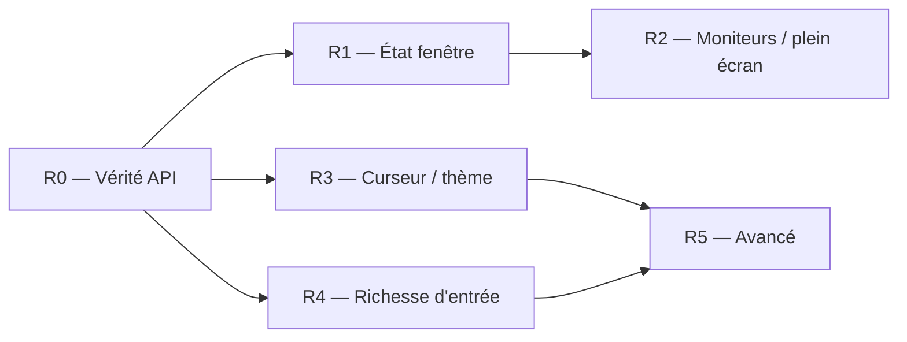

# Kadre — Plan de correction & parité winit

> Statut : **Brouillon / Proposition**
> Auteur : équipe Kadre
> Dernière mise à jour : 2026-06-01

Ce plan transforme l'**analyse d'écarts entre [winit](https://github.com/rust-windowing/winit) (la référence Rust) et Kadre** en une feuille de route ordonnée, par milestones. winit est intégré en sous-module sous `third_party/winit` à titre de référence.

---

## 1. Contexte & méthode

Kadre reproduit fidèlement l'**architecture event-loop** de winit (`ApplicationHandler`, `ControlFlow` Poll/Wait/WaitUntil, `StartCause`, `EventLoopProxy`, pump par backend). Les écarts se concentrent sur deux axes :

- **Dette interne** — une partie de l'API *déjà déclarée* n'est pas encore vraie sur tous les backends (charges utiles d'événements typées `Any`, tailles/scale codés en dur sur certains backends, un backend qui lève une exception sur `wakeUp`).
- **Couverture de surface** — l'API « capacités » de `Window` n'expose que ~7 des ~60 méthodes de winit ; des sous-systèmes entiers (moniteurs, curseur, plein écran, thème, IME, glisser-déposer, gestes) sont absents.

Le plan sépare les deux et les ordonne par dépendances :

1. **Correction (R0)** — rendre l'API *actuellement déclarée* exacte et uniforme sur les 9 backends. Aucune nouvelle surface publique.
2. **Extension parité (R1 → R5)** — ajouter les capacités winit manquantes, par couches à dépendances croissantes.

**Règle transverse :** tout ajout à l'API commune (`kadre-core`) doit livrer dans le même milestone **chaque backend** derrière (implémentation réelle ou no-op documenté), plus les tests et un dump ABI à jour. Aucune méthode déclarée sans ses 9 backends.

Cette feuille de route vise la ligne **post-1.0.0** ; elle est cohérente avec les non-objectifs déjà énoncés dans le [plan projet](./plan.md) (IME, glisser-déposer, manette différés) et les limitations connues des [spécifications](./specs.md#7-known-limitations).

---

## 2. Vue d'ensemble

| Milestone | Thème | Type | Dépend de | Effort indicatif |
|---|---|---|---|---|
| **R0** | Vérité de l'API actuelle (dette + stubs) | Correction | — | ~2–3 sem. |
| **R1** | État & géométrie de fenêtre | Extension | R0.1 | ~2 sem. |
| **R2** | Moniteurs & plein écran | Extension | R1 | ~3 sem. |
| **R3** | Curseur, thème & apparence | Extension | R0.1 | ~3 sem. |
| **R4** | Richesse d'entrée (clavier / pointeur) | Extension | R0.1 | ~3 sem. |
| **R5** | Fonctions avancées (IME, DnD, gestes…) | Optionnel / différé | R3, R4 | à la demande |

R3 et R4 sont parallélisables une fois R0.1 fait. Les chiffres d'effort sont indicatifs.

---

## 3. Milestones

### R0 — Vérité de l'API actuelle *(le cœur de la « correction »)*

**Objectif :** ce que `kadre-core` promet aujourd'hui doit être exact et uniforme sur les 9 backends.

| # | Tâche | Détail | Backends |
|---|---|---|---|
| R0.1 | **Typage fort** | `windowEvent(event: WindowEvent)`, `deviceEvent(event: DeviceEvent)` ; `Window.rawWindowHandle: RawWindowHandle`, `rawDisplayHandle: RawDisplayHandle`. Supprime tous les `Any`. | **Tous** + facade — ⚠️ breaking pour le consommateur wgpu4k (coordonner la release). |
| R0.2 | **Web : tailles / scale réels** | `innerSize`/`outerSize` via `ResizeObserver`, `scaleFactor` via `devicePixelRatio` + émettre `ScaleFactorChanged` au zoom. Le bridge Wasm a déjà l'observer — à câbler dans `WebWindow` et côté JS. | web-common, js, wasm |
| R0.3 | **iOS : `wakeUp()` réel** | Remplacer l'`UnsupportedOperationException` par un réveil thread-safe (source CFRunLoop / `performSelectorOnMainThread`) + le callback `proxyWakeUp`. | uikit |
| R0.4 | **X11 : `scaleFactor` réel** | Lire `Xft.dpi` / RANDR au lieu du `1.0` codé en dur + émettre `ScaleFactorChanged`. | x11 |
| R0.5 | **Wayland : événements résiduels** | `ScaleFactorChanged` (`wl_output.scale` / preferred scale), `Focused` (`wl_keyboard.enter/leave`), `Touch` (`wl_touch`). | wayland |
| R0.6 | **Win32 : tailles non cachées** | `innerSize`/`outerSize` via `GetClientRect`/`GetWindowRect` au lieu du cache. | win32 |

**Critères de sortie :** matrice backend uniforme sur l'API déclarée ; `event: Any` éliminé ; tests par backend ; specs §3.1.5 / §3.4 réalignées sur le code.

---

### R1 — État & géométrie de fenêtre

**Objectif :** les contrôles fenêtre les plus courants, sans nouveau sous-système.

- **`Window`** : `setResizable`/`isResizable`, `setMinimized`/`isMinimized`, `setMaximized`/`isMaximized`, `setDecorations`/`isDecorated`, `setMinSurfaceSize`/`setMaxSurfaceSize`, `outerPosition`/`setOuterPosition`, `isVisible`, getter `title()`, `prePresentNotify()`.
- **`WindowAttributes`** : `+ minSize, maxSize, position, maximized, decorations, active`.
- **Backends** : appkit / win32 / x11 / wayland = réel ; mobile / web = no-op documenté (pas de redimensionnement programmatique).

**Sortie :** parité desktop ; no-op mobile/web documentés et testés.

---

### R2 — Moniteurs & plein écran

**Objectif :** énumération des moniteurs (prérequis du plein écran exclusif).

- **Nouveaux types** : `MonitorHandle` (`id, name, position, scaleFactor, currentVideoMode, videoModes`), `VideoMode` (`size, bitDepth, refreshRate`).
- **`ActiveEventLoop`** : `availableMonitors()`, `primaryMonitor()`. **`Window`** : `currentMonitor()`.
- **`Fullscreen`** : `Borderless(MonitorHandle?)` + `Exclusive(MonitorHandle, VideoMode)` ; `Window.setFullscreen`/`fullscreen` ; `WindowAttributes.fullscreen`.
- **Backends** : appkit (`NSScreen`), win32 (`EnumDisplayMonitors` / `ChangeDisplaySettings`), x11 (RANDR) ; wayland (`wl_output` → **borderless seulement**, exclusif N/A) ; web (Fullscreen API → borderless) ; mobile (immersive / borderless).

**Sortie :** borderless partout où applicable ; exclusif sur desktop.

---

### R3 — Curseur, thème & apparence *(parallélisable avec R4)*

- **Curseur** : enum `CursorIcon` (sous-ensemble utile : Default, Pointer, Text, Crosshair, Move, bords de redimensionnement…), `setCursor`, `setCursorVisible`, `setCursorGrab(CursorGrabMode{None,Confined,Locked})`, `setCursorPosition`, `setCursorHittest`.
- **Thème** : `Theme{Light,Dark}`, `Window.theme()`/`setTheme`, événement `ThemeChanged`, `ActiveEventLoop.systemTheme()`.
- **Apparence** : `WindowLevel{AlwaysOnBottom,Normal,AlwaysOnTop}`, `setTransparent`, `setBlur`, `Icon` + `setWindowIcon`.
- **`WindowAttributes`** : `+ cursor, preferredTheme, transparent, blur, windowLevel, windowIcon`.
- **Backends** : desktop réel ; web (curseur CSS, thème via `prefers-color-scheme`, pas de grab souverain) ; mobile (majoritairement no-op documentés).

**Sortie :** curseurs standard + grab + thème sur desktop ; gaps web/mobile documentés.

---

### R4 — Richesse d'entrée *(parallélisable avec R3)*

- **Clavier** : enrichir `KeyboardInput` → `text: String?`, distinguer `physicalKey` (scancode / position) du `logicalKey`, ajouter `KeyLocation` ; ajouter l'événement `ModifiersChanged` ; `Window.resetDeadKeys()`. **Décision de modèle** à trancher ici : conserver l'enum `Key` fermé actuel **ou** adopter le modèle ouvert de winit (`Character/Named/Dead/Unidentified`).
- **Pointeur** : **décision** — conserver `MouseInput` + `Touch` (modèle historique de winit) **ou** migrer vers `PointerButton` / `PointerSource{Mouse,Touch,TabletTool}` (winit actuel). Si migration → la faire ici (breaking).
- **Événements device** : `DeviceEvent.MouseWheel` ; `ActiveEventLoop.listenDeviceEvents(DeviceEvents{Always,WhenFocused,Never})`.
- **Backends** : keymappers enrichis — xkbcommon (wayland/x11), `ToUnicode` (win32), `key`/`code` DOM (web), `NSEvent.characters` (appkit), `KeyEvent.unicodeChar` (android), `UIKey` (iOS).

**Sortie :** saisie Unicode correcte, dispositions clavier gérées, tests keymapper par backend.

---

### R5 — Fonctions avancées *(en grande partie « known limitations » specs §7 — activables à la demande)*

| Lot | Contenu | Note |
|---|---|---|
| IME | événement `Ime`, `requestImeUpdate`, `ImePurpose`, `imeCapabilities` | specs §7 « future » |
| Glisser-déposer | `DragEntered/Moved/Dropped/Left` | — |
| Gestes trackpad | `PinchGesture/PanGesture/RotationGesture/DoubleTapGesture/TouchpadPressure` | surtout macOS / iOS |
| Curseurs custom | `CustomCursor`, `CursorImage`, animations, `createCustomCursor` | — |
| Divers fenêtre | `UserAttentionType`, `Occluded`, `ActivationTokenDone`, `contentProtected`, `safeArea`, `showWindowMenu`, `dragWindow` / `dragResizeWindow`, `memoryWarning` (mobile) | — |
| Manette | *hors périmètre de winit lui-même* (délégué à gilrs) → ne pas viser la parité | specs §7 |

**Sortie :** chaque lot indépendant ; aucun n'est bloquant pour une 1.0.

---

## 4. Chantiers transverses

- **Coordination du breaking change R0.1** : le passage `Any → WindowEvent / RawWindowHandle` casse le `when` exhaustif du consommateur (renderer wgpu4k) — versionner et prévenir.
- **CI** : étendre la matrice par backend (specs §5) à chaque milestone ; smoke tests Xvfb / weston pour Linux.
- **Dumps ABI** : régénérer Android (`.api`) et iOS (`.klib`) à chaque ajout public (déjà la pratique — cf. PRs #165 / #166).
- **Docs** : maintenir à jour le tableau de mapping specs §8 et la matrice de maturité des backends à chaque milestone.

---

## 5. Séquencement

R0 d'abord (débloque tout). Puis R1 → R2 (chaîne fenêtre → moniteur) en parallèle de R3 et R4. R5 en dernier, à la carte.

---

## 6. Traçabilité écart → milestone

| Écart (vs winit) | Milestone |
|---|---|
| Typage `event: Any`, `rawHandle: Any` | R0.1 |
| Web tailles / scale codés en dur | R0.2 |
| iOS `wakeUp()` lève une exception | R0.3 |
| X11 `scaleFactor` = 1.0 | R0.4 |
| Wayland sans `ScaleFactorChanged` / `Focused` / `Touch` | R0.5 |
| Win32 tailles en cache | R0.6 |
| minimize / maximize / resizable / décorations / min-max size / position | R1 |
| `MonitorHandle` / `VideoMode` / plein écran | R2 |
| curseur (icône / grab / visibilité / position / hittest) | R3 |
| thème + `ThemeChanged` + `systemTheme` | R3 |
| `WindowLevel`, transparent / blur, icône de fenêtre | R3 |
| clavier `text` / physique vs logique / `KeyLocation` | R4 |
| `ModifiersChanged`, `DeviceEvent.MouseWheel`, `listenDeviceEvents` | R4 |
| modèle pointeur (unifier vs conserver) | R4 |
| IME, glisser-déposer, gestes, curseurs custom, attention, occluded… | R5 |

---

## Documents associés

- [Plan projet](./plan.md)
- [Spécifications techniques](./specs.md)
- [Stabilité API](./api-stability.md)
- [Sprint review](./sprint-review.md)
