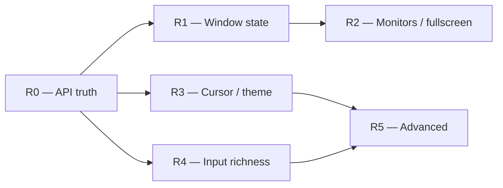

# Kadre — Remediation & winit-Parity Plan

> Status: **Draft / Proposal**
> Author: Kadre team
> Last updated: 2026-06-01

This plan turns the **gap analysis between [winit](https://github.com/rust-windowing/winit) (the Rust reference) and Kadre** into an ordered, milestone-based roadmap. winit is vendored as a submodule under `third_party/winit` for reference.

---

## 1. Context & method

Kadre faithfully reproduces winit's **event-loop architecture** (`ApplicationHandler`, `ControlFlow` Poll/Wait/WaitUntil, `StartCause`, `EventLoopProxy`, per-backend pump). The gaps are concentrated in two areas:

- **Internal debt** — parts of the *already-declared* API are not yet true on every backend (event payloads typed `Any`, hardcoded sizes/scale on some backends, one platform throwing on `wakeUp`).
- **Surface coverage** — the `Window` "capabilities" API exposes ~7 of winit's ~60 methods; whole subsystems (monitors, cursor, fullscreen, theme, IME, drag & drop, gestures) are absent.

The plan separates the two and orders them by dependency:

1. **Correction (R0)** — make the *currently declared* API correct and uniform across the 9 backends. No new public surface.
2. **Parity extension (R1 → R5)** — add the missing winit capabilities in layers of increasing dependency.

**Cross-cutting rule:** any addition to the common API (`kadre-core`) must ship in the same milestone with **every backend** behind it (real implementation or documented no-op), plus tests and an updated ABI dump. No declared method without its 9 backends.

This roadmap targets the **post-1.0.0** line; it is consistent with the non-goals already stated in the [project plan](./plan.md) (IME, drag & drop, gamepad deferred) and the known limitations in the [specs](./specs.md#7-known-limitations).

---

## 2. Overview

| Milestone | Theme | Type | Depends on | Indicative effort |
|---|---|---|---|---|
| **R0** | Truth of the current API (debt + stubs) | Correction | — | ~2–3 weeks |
| **R1** | Window state & geometry | Extension | R0.1 | ~2 weeks |
| **R2** | Monitors & fullscreen | Extension | R1 | ~3 weeks |
| **R3** | Cursor, theme & appearance | Extension | R0.1 | ~3 weeks |
| **R4** | Input richness (keyboard / pointer) | Extension | R0.1 | ~3 weeks |
| **R5** | Advanced features (IME, DnD, gestures…) | Optional / deferred | R3, R4 | on demand |

R3 and R4 are parallelizable once R0.1 is done. Effort figures are indicative.

---

## 3. Milestones

### R0 — Truth of the current API *(the core "correction")*

**Goal:** what `kadre-core` promises today must be exact and uniform across the 9 backends.

| # | Task | Detail | Backends |
|---|---|---|---|
| R0.1 | **Strong typing** | `windowEvent(event: WindowEvent)`, `deviceEvent(event: DeviceEvent)`; `Window.rawWindowHandle: RawWindowHandle`, `rawDisplayHandle: RawDisplayHandle`. Removes every `Any`. | **All** + facade — ⚠️ breaking for the wgpu4k consumer (coordinate the release). |
| R0.2 | **Web: real sizes / scale** | `innerSize`/`outerSize` via `ResizeObserver`, `scaleFactor` via `devicePixelRatio` + emit `ScaleFactorChanged` on zoom. The Wasm bridge already has the observer — wire it into `WebWindow` and the JS side. | web-common, js, wasm |
| R0.3 | **iOS: real `wakeUp()`** | Replace the `UnsupportedOperationException` with a thread-safe wake (CFRunLoop source / `performSelectorOnMainThread`) + the `proxyWakeUp` callback. | uikit |
| R0.4 | **X11: real `scaleFactor`** | Read `Xft.dpi` / RANDR instead of the hardcoded `1.0` + emit `ScaleFactorChanged`. | x11 |
| R0.5 | **Wayland: residual events** | `ScaleFactorChanged` (`wl_output.scale` / preferred scale), `Focused` (`wl_keyboard.enter/leave`), `Touch` (`wl_touch`). | wayland |
| R0.6 | **Win32: uncached sizes** | `innerSize`/`outerSize` via `GetClientRect`/`GetWindowRect` instead of the cache. | win32 |

**Exit criteria:** backend matrix uniform on the declared API; `event: Any` eliminated; per-backend tests; specs §3.1.5 / §3.4 realigned with the code.

---

### R1 — Window state & geometry

**Goal:** the most common window controls, with no new subsystem.

- **`Window`:** `setResizable`/`isResizable`, `setMinimized`/`isMinimized`, `setMaximized`/`isMaximized`, `setDecorations`/`isDecorated`, `setMinSurfaceSize`/`setMaxSurfaceSize`, `outerPosition`/`setOuterPosition`, `isVisible`, `title()` getter, `prePresentNotify()`.
- **`WindowAttributes`:** `+ minSize, maxSize, position, maximized, decorations, active`.
- **Backends:** appkit / win32 / x11 / wayland = real; mobile / web = documented no-op (no programmatic resize).

**Exit:** desktop parity; documented & tested no-ops on mobile/web.

---

### R2 — Monitors & fullscreen

**Goal:** monitor enumeration (prerequisite for exclusive fullscreen).

- **New types:** `MonitorHandle` (`id, name, position, scaleFactor, currentVideoMode, videoModes`), `VideoMode` (`size, bitDepth, refreshRate`).
- **`ActiveEventLoop`:** `availableMonitors()`, `primaryMonitor()`. **`Window`:** `currentMonitor()`.
- **`Fullscreen`:** `Borderless(MonitorHandle?)` + `Exclusive(MonitorHandle, VideoMode)`; `Window.setFullscreen`/`fullscreen`; `WindowAttributes.fullscreen`.
- **Backends:** appkit (`NSScreen`), win32 (`EnumDisplayMonitors` / `ChangeDisplaySettings`), x11 (RANDR); wayland (`wl_output` → **borderless only**, exclusive N/A); web (Fullscreen API → borderless); mobile (immersive / borderless).

**Exit:** borderless fullscreen everywhere applicable; exclusive on desktop.

---

### R3 — Cursor, theme & appearance *(parallelizable with R4)*

- **Cursor:** `CursorIcon` enum (useful subset: Default, Pointer, Text, Crosshair, Move, resize edges…), `setCursor`, `setCursorVisible`, `setCursorGrab(CursorGrabMode{None,Confined,Locked})`, `setCursorPosition`, `setCursorHittest`.
- **Theme:** `Theme{Light,Dark}`, `Window.theme()`/`setTheme`, `ThemeChanged` event, `ActiveEventLoop.systemTheme()`.
- **Appearance:** `WindowLevel{AlwaysOnBottom,Normal,AlwaysOnTop}`, `setTransparent`, `setBlur`, `Icon` + `setWindowIcon`.
- **`WindowAttributes`:** `+ cursor, preferredTheme, transparent, blur, windowLevel, windowIcon`.
- **Backends:** desktop real; web (CSS cursor, theme via `prefers-color-scheme`, no sovereign grab); mobile (mostly documented no-op).

**Exit:** standard cursors + grab + theme on desktop; documented web/mobile gaps.

---

### R4 — Input richness *(parallelizable with R3)*

- **Keyboard:** enrich `KeyboardInput` → `text: String?`, distinguish `physicalKey` (scancode / position) from `logicalKey`, add `KeyLocation`; add the `ModifiersChanged` event; `Window.resetDeadKeys()`. **Model decision** to settle here: keep the current closed `Key` enum **or** adopt winit's open model (`Character/Named/Dead/Unidentified`).
- **Pointer:** **decision** — keep `MouseInput` + `Touch` (winit's historical model) **or** migrate to `PointerButton` / `PointerSource{Mouse,Touch,TabletTool}` (current winit). If migrating, do it here (breaking).
- **Device events:** `DeviceEvent.MouseWheel`; `ActiveEventLoop.listenDeviceEvents(DeviceEvents{Always,WhenFocused,Never})`.
- **Backends:** enriched keymappers — xkbcommon (wayland/x11), `ToUnicode` (win32), DOM `key`/`code` (web), `NSEvent.characters` (appkit), `KeyEvent.unicodeChar` (android), `UIKey` (iOS).

**Exit:** correct Unicode text input, keyboard layouts handled, per-backend keymapper tests.

---

### R5 — Advanced features *(mostly "known limitations" in specs §7 — enable on demand)*

| Lot | Content | Note |
|---|---|---|
| IME | `Ime` event, `requestImeUpdate`, `ImePurpose`, `imeCapabilities` | specs §7 "future" |
| Drag & drop | `DragEntered/Moved/Dropped/Left` | — |
| Trackpad gestures | `PinchGesture/PanGesture/RotationGesture/DoubleTapGesture/TouchpadPressure` | mainly macOS / iOS |
| Custom cursors | `CustomCursor`, `CursorImage`, animations, `createCustomCursor` | — |
| Misc window | `UserAttentionType`, `Occluded`, `ActivationTokenDone`, `contentProtected`, `safeArea`, `showWindowMenu`, `dragWindow` / `dragResizeWindow`, `memoryWarning` (mobile) | — |
| Gamepad | *out of winit's own scope* (delegated to gilrs) → do not target parity | specs §7 |

**Exit:** each lot independent; none blocks a 1.0.

---

## 4. Cross-cutting concerns

- **R0.1 breaking-change coordination:** the `Any → WindowEvent / RawWindowHandle` switch breaks the consumer's exhaustive `when` (wgpu4k renderer) — version and announce it.
- **CI:** extend the per-backend matrix (specs §5) at each milestone; Xvfb / weston smoke tests for Linux.
- **ABI dumps:** regenerate Android (`.api`) and iOS (`.klib`) on every public addition (already the practice — see PRs #165 / #166).
- **Docs:** keep the specs §8 mapping table and the backend maturity matrix up to date at each milestone.

---

## 5. Sequencing

R0 first (it unblocks everything). Then R1 → R2 (window → monitor chain) in parallel with R3 and R4. R5 last, à la carte.

---

## 6. Gap → milestone traceability

| Gap (vs winit) | Milestone |
|---|---|
| `event: Any`, `rawHandle: Any` typing | R0.1 |
| Web hardcoded size / scale | R0.2 |
| iOS `wakeUp()` throws | R0.3 |
| X11 `scaleFactor` = 1.0 | R0.4 |
| Wayland missing `ScaleFactorChanged` / `Focused` / `Touch` | R0.5 |
| Win32 cached sizes | R0.6 |
| minimize / maximize / resizable / decorations / min-max size / position | R1 |
| `MonitorHandle` / `VideoMode` / fullscreen | R2 |
| cursor (icon / grab / visible / position / hittest) | R3 |
| theme + `ThemeChanged` + `systemTheme` | R3 |
| `WindowLevel`, transparent / blur, window icon | R3 |
| keyboard `text` / physical vs logical / `KeyLocation` | R4 |
| `ModifiersChanged`, `DeviceEvent.MouseWheel`, `listenDeviceEvents` | R4 |
| pointer model (unify vs keep) | R4 |
| IME, drag & drop, gestures, custom cursors, attention, occluded… | R5 |

---

## Associated documents

- [Project plan](./plan.md)
- [Technical specifications](./specs.md)
- [API stability](./api-stability.md)
- [Sprint review](./sprint-review.md)
