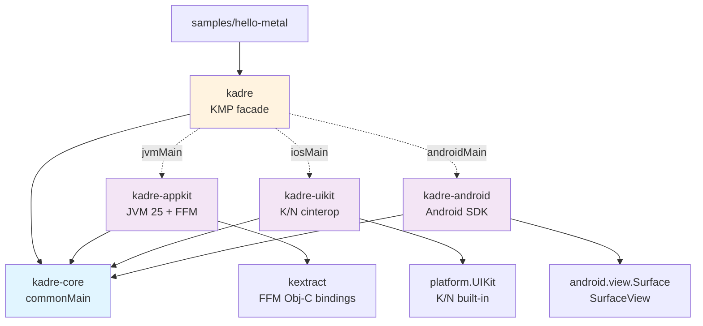
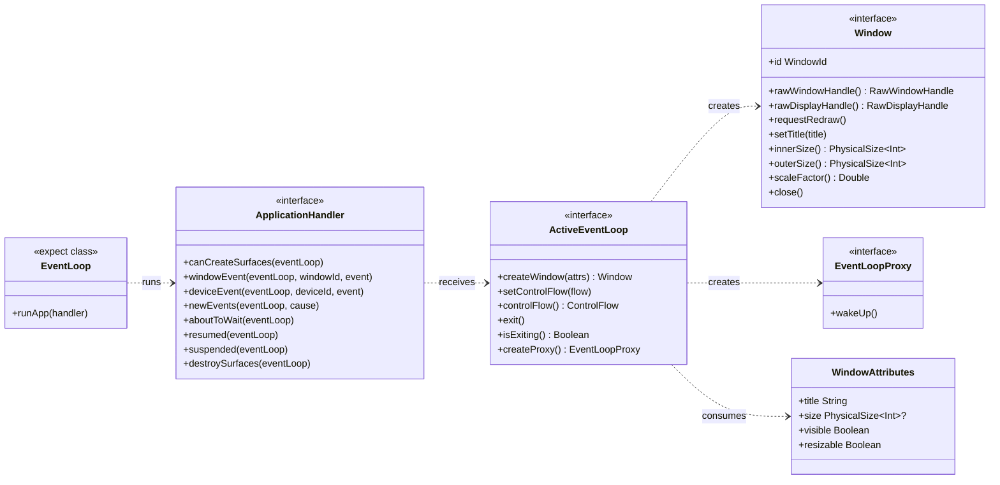
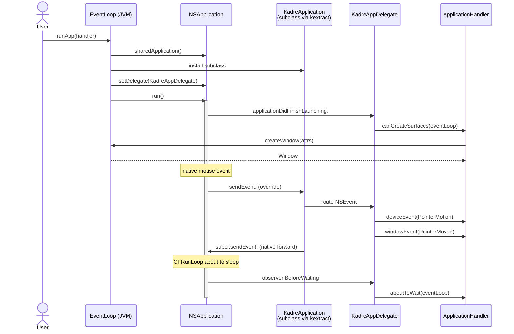
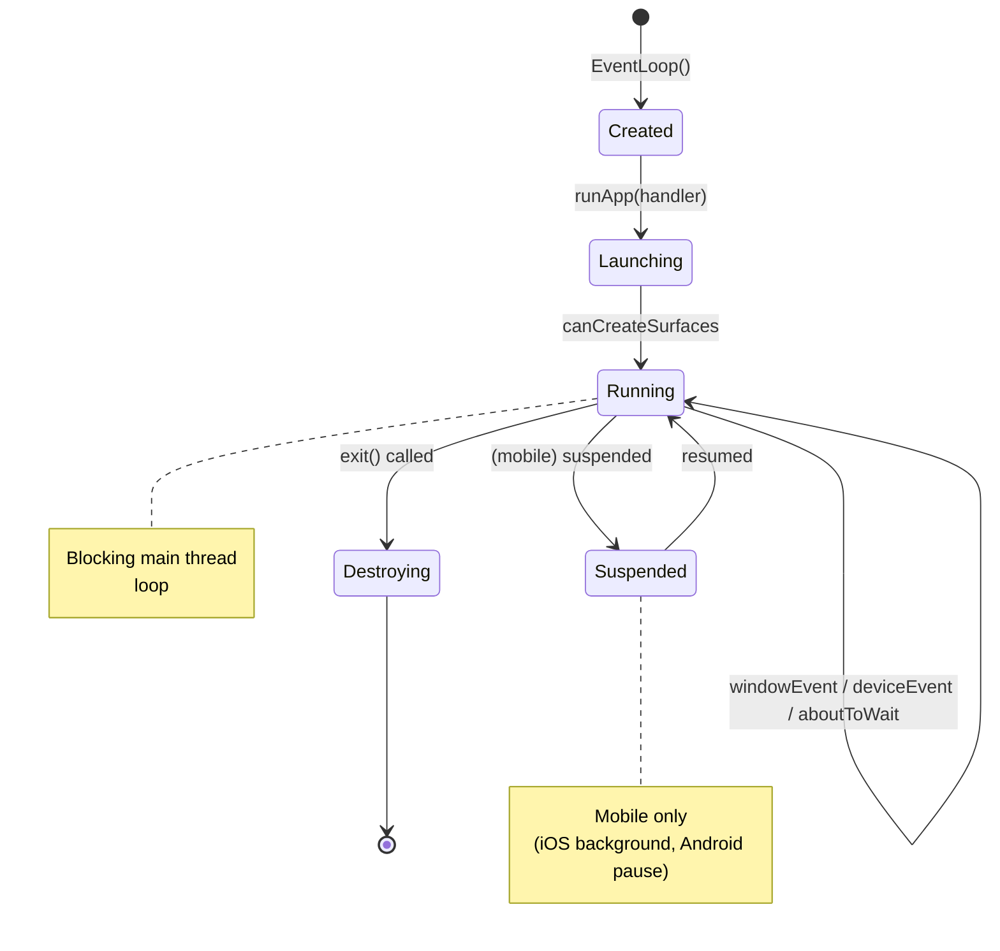

# Kadre — Technical Specifications

> Status: **Draft for review**
> Reference document for the implementation of milestones M1, M2, M3 described in the [project plan](./plan.md).

---

## 1. Overview

Kadre is a Kotlin Multiplatform library that abstracts, for Apple Desktop, Apple Mobile, and Android:

- **Native window creation** (NSWindow, UIWindow, Activity Surface).
- The **event loop** of the host platform (CFRunLoop, iOS RunLoop, Activity lifecycle).
- **Events**: keyboard/mouse/touch and low-level device events.
- **Native handles** (`raw window handle`) consumable by an external 3D renderer (wgpu4k, or any GPU lib).

**Direct inspiration**: [winit](https://github.com/rust-windowing/winit), with idiomatic Kotlin adaptation (sealed interfaces, `expect`/`actual`, null-safety, coroutines).

**Out of scope**: rendering, GPU resources, fonts, high-level accessibility, layout, Compose.

---

## 2. Modular architecture

### 2.1 Module diagram



### 2.2 Binding strategies

| Module | KMP targets | Binding | Dedicated native lib? |
|--------|-------------|---------|----------------------|
| `kadre-core` | jvm, android, iosX64/Arm64/SimArm64 | — (pure Kotlin) | no |
| `kadre-appkit` | jvm | FFM JVM 25 via **kextract** | no (runtime linkage AppKit) |
| `kadre-uikit` | iosX64, iosArm64, iosSimulatorArm64 | **cinterop** Kotlin/Native (built-in Apple frameworks) | no |
| `kadre-android` | android | None — Android SDK + raw `android.view.Surface` | no |
| `kadre` (facade) | all | `expect`/`actual` | no |

**Consequence**: 3 binding toolchains coexist. The `kadre-core` contract forces them to converge on the same public API.

---

## 3. Public API (`kadre-core`)

### 3.1 Core interfaces

```kotlin
// commonMain — pure interfaces, no native references

interface ApplicationHandler {
    /** Called once when the compositor is ready to receive surfaces. Required. */
    fun canCreateSurfaces(eventLoop: ActiveEventLoop)

    /** Called for each window-scoped event. Required. */
    fun windowEvent(
        eventLoop: ActiveEventLoop,
        windowId: WindowId,
        event: WindowEvent,
    )

    /** Low-level events (raw mouse delta, raw keys), not scoped to a window. */
    fun deviceEvent(
        eventLoop: ActiveEventLoop,
        deviceId: DeviceId?,
        event: DeviceEvent,
    ) {}

    fun newEvents(eventLoop: ActiveEventLoop, cause: StartCause) {}
    fun aboutToWait(eventLoop: ActiveEventLoop) {}

    /** Mobile only. */
    fun resumed(eventLoop: ActiveEventLoop) {}
    fun suspended(eventLoop: ActiveEventLoop) {}

    /** Android: the Surface was destroyed — release GPU surfaces before returning. */
    fun destroySurfaces(eventLoop: ActiveEventLoop) {}
}

interface ActiveEventLoop {
    fun createWindow(attrs: WindowAttributes): Window
    fun setControlFlow(flow: ControlFlow)
    fun controlFlow(): ControlFlow
    fun exit()
    fun isExiting(): Boolean
    fun createProxy(): EventLoopProxy
}

interface Window {
    val id: WindowId
    fun rawWindowHandle(): RawWindowHandle
    fun rawDisplayHandle(): RawDisplayHandle
    fun requestRedraw()
    fun setTitle(title: String)
    fun innerSize(): PhysicalSize<Int>
    fun outerSize(): PhysicalSize<Int>
    fun scaleFactor(): Double
    fun setVisible(visible: Boolean)
    fun close()
}

/** Lightweight thread-safe handle for waking the loop from another thread. */
interface EventLoopProxy {
    fun wakeUp()
}

expect class EventLoop() {
    fun runApp(handler: ApplicationHandler)
}
```

### 3.2 Class diagram



---

## 4. Event model

### 4.1 `WindowEvent` (window-scoped)

```kotlin
sealed interface WindowEvent {
    object CloseRequested : WindowEvent
    data class Resized(val size: PhysicalSize<Int>) : WindowEvent
    data class Moved(val position: PhysicalPosition<Int>) : WindowEvent
    data class ScaleFactorChanged(val factor: Double) : WindowEvent
    data class Focused(val gained: Boolean) : WindowEvent
    data class KeyboardInput(
        val key: Key,
        val state: KeyState,
        val modifiers: Modifiers,
    ) : WindowEvent
    data class PointerMoved(val position: PhysicalPosition<Double>) : WindowEvent
    object PointerEntered : WindowEvent
    object PointerLeft : WindowEvent
    data class MouseInput(val button: MouseButton, val state: KeyState) : WindowEvent
    data class MouseWheel(val deltaX: Double, val deltaY: Double) : WindowEvent
    data class Touch(val phase: TouchPhase, val location: PhysicalPosition<Double>, val id: Long) : WindowEvent
    object RedrawRequested : WindowEvent
    object Destroyed : WindowEvent
}
```

### 4.2 `DeviceEvent` (raw, outside window)

```kotlin
sealed interface DeviceEvent {
    data class PointerMotion(val dx: Double, val dy: Double) : DeviceEvent
    data class Button(val button: Int, val state: KeyState) : DeviceEvent
    data class Key(val scancode: Int, val state: KeyState) : DeviceEvent
}
```

### 4.3 DPI types

```kotlin
data class PhysicalSize<T : Number>(val width: T, val height: T)
data class LogicalSize<T : Number>(val width: T, val height: T)
data class PhysicalPosition<T : Number>(val x: T, val y: T)
data class LogicalPosition<T : Number>(val x: T, val y: T)
```

> Choice: no Rust-style `Pixel` trait for the POC. Logical ↔ physical conversions are explicit extensions with a `scaleFactor: Double`.

---

## 5. Event loop

### 5.1 Usage pattern

```kotlin
class HelloApp : ApplicationHandler {
    private var window: Window? = null

    override fun canCreateSurfaces(eventLoop: ActiveEventLoop) {
        window = eventLoop.createWindow(WindowAttributes(title = "Hello Kadre"))
    }

    override fun windowEvent(
        eventLoop: ActiveEventLoop,
        windowId: WindowId,
        event: WindowEvent,
    ) {
        when (event) {
            is WindowEvent.CloseRequested -> eventLoop.exit()
            is WindowEvent.RedrawRequested -> { /* renderer.draw() */ }
            else -> {}
        }
    }
}

fun main() {
    EventLoop().runApp(HelloApp())
}
```

### 5.2 Sequence diagram — mouse event on macOS



### 5.3 Event lifecycle



---

## 6. 3D integration — Raw handles

### 6.1 Contract

```kotlin
sealed interface RawWindowHandle {
    /** macOS — NSView and NSWindow pointers cast to Long. */
    data class AppKit(val nsView: Long, val nsWindow: Long) : RawWindowHandle

    /** iOS — UIView and UIViewController pointers cast to Long. */
    data class UiKit(val uiView: Long, val uiViewController: Long?) : RawWindowHandle

    /** Android — java android.view.Surface instance, boxed as Any for commonMain. */
    data class Android(val surface: Any) : RawWindowHandle
}

sealed interface RawDisplayHandle {
    object AppKit : RawDisplayHandle
    object UiKit : RawDisplayHandle
    object Android : RawDisplayHandle
}
```

> The choice of `Long` for pointers keeps the interface in commonMain. The backend casts to the native type at the point of use (`MemorySegment` on the FFM side, `COpaquePointer` on K/N).

### 6.2 Metal preparation (macOS)

On AppKit, the returned `contentView` must have:

- `wantsLayer = true`
- `layer = CAMetalLayer()` (or override `makeBackingLayer()` returning `CAMetalLayer`)

On the wgpu4k / native Metal side, the renderer does:

```objc
NSView* contentView = (__bridge NSView*)((void*)nsView);
CAMetalLayer* layer = (CAMetalLayer*)[contentView layer];
// configure pixelFormat, drawableSize, etc.
```

### 6.3 Vulkan preparation (via MoltenVK on Apple)

The renderer creates a `VkSurfaceKHR` via the `VK_EXT_metal_surface` extension from the exposed `CAMetalLayer`.

### 6.4 Vulkan / OpenGL ES preparation (Android)

The renderer receives the raw `android.view.Surface` instance. It then calls on the native side:

```c
ANativeWindow* win = ANativeWindow_fromSurface(env, surface);
// then VK_KHR_android_surface or EGL
```

**No native lib on the Kadre side** — this is intentional ([Strategy A](./plan.md#11-locked-architecture-decisions)).

---

## 7. Threading model

| Rule | Application |
|------|-------------|
| `EventLoop()` must be constructed on the main thread | Runtime assertion `require(Thread.currentThread() == mainThread)` |
| `runApp(handler)` blocks the main thread | Documented; typically called from `main()` |
| All `ApplicationHandler` callbacks are guaranteed main-thread | The backend never dispatches off-main |
| `EventLoopProxy.wakeUp()` is the only thread-safe API | Coalesced: multiple calls = a single wake-up |
| Implementation: main dispatch | macOS/iOS: `dispatch_async(dispatch_get_main_queue())` + `CFRunLoopWakeUp`; Android: `Handler(Looper.getMainLooper()).post{}` |

---

## 8. Platform-specific considerations

### 8.1 AppKit (macOS Desktop)

- `NSApplicationActivationPolicyRegular` for Dock visibility.
- `NSWindowStyleMask` configured via `WindowAttributes` (titled, closable, resizable, miniaturizable).
- contentView with `wantsLayer = true` by default (for Metal).
- Event interception:
  - **Subclass** `KadreApplication : NSApplication` overriding `sendEvent:`.
  - Subclass `KadreAppDelegate : NSObject<NSApplicationDelegate>` for `applicationDidFinishLaunching:` etc.
  - Subclass `KadreWindowDelegate : NSObject<NSWindowDelegate>` for `windowDidResize:`, `windowShouldClose:`, etc.
- CFRunLoopObserver for `BeforeWaiting` → `aboutToWait` callback.
- Everything goes through **kextract**: finalization of subclassing support is the critical path.

### 8.2 UIKit (iOS)

- Entry point: `UIApplicationMain` with an Obj-C `AppDelegate` declared via `@ExportObjCClass` (K/N).
- `UISceneConfiguration` (iOS 13+) for the multi-scene architecture.
- `UIWindow` created by the system, root `UIViewController` hosting a layer-backed `UIView`.
- Apple lifecycle:
  - `applicationDidBecomeActive` → `resumed`
  - `applicationWillResignActive` → `suspended`
  - `applicationDidEnterBackground` → optional `destroySurfaces` (depending on GPU strategy)
- Bindings via **cinterop** (`platform.UIKit`, `platform.QuartzCore`, `platform.Foundation`).
- Touch events: `UITouch` → `WindowEvent.Touch`.

### 8.3 Android

- Entry point: `KadreActivity : AppCompatActivity` hosting a full-screen `SurfaceView`.
- `SurfaceHolder.Callback`:
  - `surfaceCreated(holder)` → `canCreateSurfaces`
  - `surfaceChanged(holder, format, width, height)` → `WindowEvent.Resized`
  - `surfaceDestroyed(holder)` → `destroySurfaces`
- Activity lifecycle:
  - `onResume` → `resumed`
  - `onPause` → `suspended`
- Frame cadence: `Choreographer.postFrameCallback{}` for vsync.
- Surface exposed raw via `RawWindowHandle.Android(surface)` ([Strategy A](./plan.md#11-locked-architecture-decisions)).
- Touch events: `MotionEvent` → `WindowEvent.Touch`.
- Minimum API: Android 24 (Nougat).

---

## 9. Known POC limitations

- **M1 and M2**: macOS Desktop only.
- No **multi-window** before M3.
- No **clipboard**, **drag & drop**, **IME** in V1.
- No explicit **high refresh rate** (120/144 Hz) support before V2.
- macOS pre-13 (Ventura) not supported.
- iOS pre-15 not supported.
- Android API < 24 not supported.

---

## 10. Appendices

### 10.1 winit → Kadre mapping

| winit (Rust) | Kadre (Kotlin) |
|--------------|-----------------|
| `trait ApplicationHandler` | `interface ApplicationHandler` |
| `trait ActiveEventLoop` | `interface ActiveEventLoop` |
| `enum WindowEvent` | `sealed interface WindowEvent` |
| `enum DeviceEvent` | `sealed interface DeviceEvent` |
| `Result<Box<dyn Window>>` | `Window` (exceptions surfaced in POC) |
| `MainThreadBound<T>` | runtime check on main thread |
| `EventLoopProxy::send_event(T)` | `EventLoopProxy.wakeUp()` — no payload, coalesced |
| `raw-window-handle` crate | `RawWindowHandle` sealed interface |
| `cfg(macos_platform)` | `expect`/`actual` jvmMain |
| `Retained<NSWindow>` | Kotlin reference (ARC managed by kextract / K/N) |

### 10.2 External references

- [winit](https://github.com/rust-windowing/winit) — architecture reference
- [raw-window-handle](https://github.com/rust-windowing/raw-window-handle) — handle contract
- [wgpu4k](https://github.com/wgpu4k/wgpu4k) — target renderer
- [JEP 454 — Foreign Function & Memory API](https://openjdk.org/jeps/454) — FFM JVM interop
- [Kotlin/Native cinterop](https://kotlinlang.org/docs/native-c-interop.html)

### 10.3 Associated documents

- [Project plan](./plan.md)
