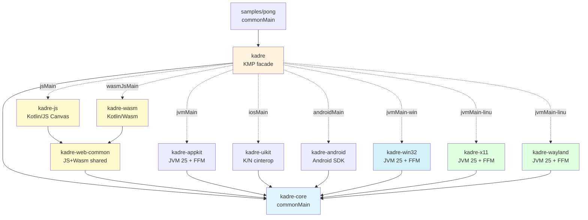
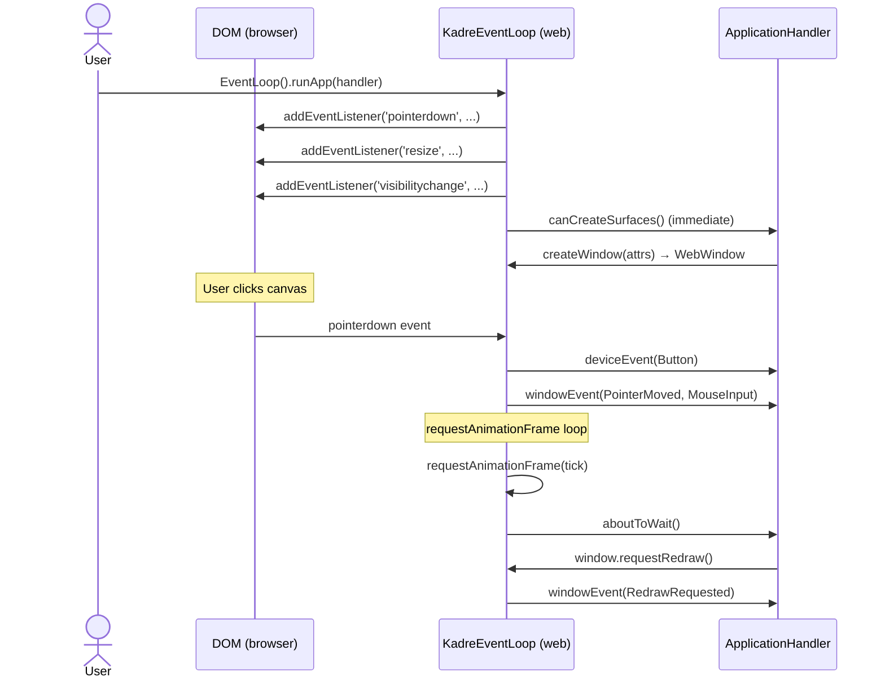
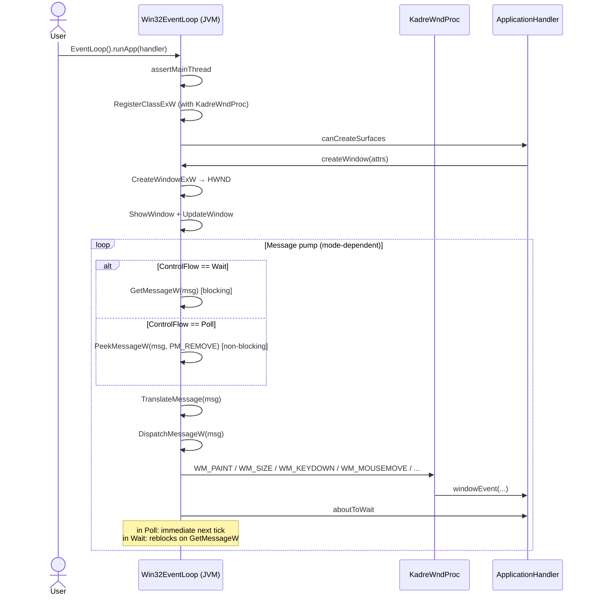
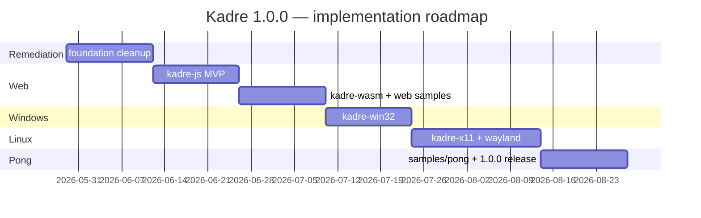

# Kadre — Technical Specifications

> Status: **Canonical** — review PR #49 integrated
> Reference document for the implementation described in the [project plan](./plan.md).

This document covers the architecture and the platform-specific contracts. The public API (§3), event model (§4), event loop (§5), and threading model (§7) apply across all backends; the per-platform additions for Web, Windows, and Linux are described here.

**Review fixes (PR #49)**:
- §2.1 — `RawWindowHandle.Web` accepts `canvasElement` directly (Shadow DOM, SPA frameworks)
- §3.1.3 — `Wait` mode on Web: single RAF instead of continuous loop
- §3.2.2 — Win32: `PeekMessageW` in `Poll`, `GetMessageW` in `Wait`
- §3.2.7 — Win32: `Arena.ofShared` for WndProc upcall stub (process lifetime)
- §3.3.2 — X11: `XPending` + `XNextEvent` in `Poll`, `select` in `WaitUntil`
- §3.4.2 — Wayland: `wl_display_prepare_read` + non-blocking `poll` + `eventfd` for wakeUp
- §3.5 — Linux detection: lazy FFM symbol loading + `try/catch Throwable`

---

## 1. Architecture — modular overview

### 1.1 Extended module diagram



### 1.2 Binding strategies

| Module | KMP targets | Binding | Native lib? |
|--------|------------|---------|------------|
| `kadre-web-common` | jsMain, wasmJsMain | — (pure Kotlin) | no |
| `kadre-js` | jsMain (browser) | JS DOM via `kotlin-wrappers-browser` or similar | no |
| `kadre-wasm` | wasmJsMain (browser) | Wasm JS interop to DOM | no |
| `kadre-win32` | jvm (Windows-specific) | kextract FFM Win32 (User32, Gdi32, Kernel32) | no |
| `kadre-x11` | jvm (Linux-specific) | kextract FFM Xlib + XInput2 | no |
| `kadre-wayland` | jvm (Linux-specific) | kextract FFM libwayland-client + xdg_shell | no |
| `kadre` (facade) | all (6 platforms) | expect/actual | no |

**Linux decoupling**: `kadre-x11` and `kadre-wayland` are two **separate modules**, like `kadre-appkit` and `kadre-uikit`. The facade contains a **runtime selection logic** in the `linuxMain` source set that picks the backend at startup.

---

## 2. Public API — RawWindowHandle / RawDisplayHandle

### 2.1 `RawWindowHandle` variants

```kotlin
sealed interface RawWindowHandle {
    // Desktop / mobile
    data class AppKit(val nsView: Long, val nsWindow: Long, val nsLayer: Long) : RawWindowHandle
    data class UiKit(val uiView: Long, val uiViewController: Long?) : RawWindowHandle
    data class Android(val surface: Any) : RawWindowHandle

    // Web / Windows / Linux
    /**
     * Web: reference to the HTML canvas to attach the wgpu.Surface to.
     *
     * Two mutually exclusive modes:
     * - `canvasElementId`: id to resolve via `document.getElementById` (simple case, static page).
     * - `canvasElement`: direct reference (HTMLCanvasElement on the JS side, equivalent on Wasm).
     *   Required for SPA frameworks (Compose HTML, React/Vue/Angular)
     *   and canvases in a Shadow DOM (invisible to `getElementById`).
     *
     * At least one must be non-null. If both are provided, `canvasElement` takes priority.
     */
    data class Web(
        val canvasElementId: String? = null,
        val canvasElement: Any? = null,
    ) : RawWindowHandle {
        init {
            require(canvasElementId != null || canvasElement != null) {
                "RawWindowHandle.Web requires either canvasElementId or canvasElement"
            }
        }
    }

    /** Windows: HWND + HINSTANCE as Long. */
    data class Win32(val hwnd: Long, val hinstance: Long) : RawWindowHandle

    /** Linux X11: Window handle (XID) + Display pointer. */
    data class Xlib(val window: Long, val display: Long) : RawWindowHandle

    /** Linux Wayland: wl_surface + wl_display pointers. */
    data class Wayland(val surface: Long, val display: Long) : RawWindowHandle
}
```

### 2.2 `RawDisplayHandle` variants

```kotlin
sealed interface RawDisplayHandle {
    // Desktop / mobile
    object AppKit : RawDisplayHandle
    object UiKit : RawDisplayHandle
    object Android : RawDisplayHandle

    // Web / Windows / Linux
    object Web : RawDisplayHandle
    data class Win32(val hinstance: Long) : RawDisplayHandle
    data class Xlib(val display: Long) : RawDisplayHandle
    data class Wayland(val display: Long) : RawDisplayHandle
}
```

### 2.3 Backward compatibility

- **No** existing interface signature is modified.
- Only sealed interface **variants** are added (safe extension for consumers doing exhaustive `when` → they will need to recompile but their code remains valid after adding the missing branches).
- The only source-compat impact is for consumers doing an exhaustive `when` on `RawWindowHandle` (expected case: wgpu4k renderer).

---

## 3. Platform-specific considerations (Web, Windows, Linux)

### 3.1 Web (kadre-js + kadre-wasm + kadre-web-common)

#### 3.1.1 Shared architecture

`kadre-web-common` hosts:
- `DOMEvent → WindowEvent` mapping (PointerEvent, KeyboardEvent, etc.)
- DOM lifecycle (`visibilitychange`, `pagehide`/`pageshow`)
- `<canvas>` HTML management (resize via ResizeObserver, devicePixelRatio)
- Abstract `WebDomBridge` interface (actual JS / actual Wasm)

`kadre-js` and `kadre-wasm` only implement the DOM **bridge** (JS-specific interop).

#### 3.1.2 Web event loop

There is no "main thread" on Web — the JS runtime is single-threaded by default. The event loop is:



**`runApp()` does not block on Web**: it registers DOM listeners + starts the `requestAnimationFrame` loop, then returns. The page stays alive via the `requestAnimationFrame` loop.

**Implication**: on Web, `runApp` does not have the same semantics as on Desktop. Document explicitly.

#### 3.1.3 ControlFlow on Web

- `Wait`: **no** continuous `requestAnimationFrame` loop. DOM events (input, resize, visibilitychange) wake the loop. When `requestRedraw()` is called from a handler in Wait mode, **a single `requestAnimationFrame(tick)` is scheduled** to produce the frame, then the app returns to rest. Preserves CPU and battery (critical on mobile/laptop).
- `Poll`: continuous `requestAnimationFrame`, re-chained on each tick (60 Hz browser cap, 120 Hz on ProMotion screens).
- `WaitUntil(deadline)`: `setTimeout(deadline - now)` that triggers a single `requestAnimationFrame` on expiry.

**Coalescing**: a `rafScheduled` flag prevents registering multiple concurrent RAFs for the same tick. Multiple calls to `requestRedraw()` between two frames → a single RAF.

`EventLoopProxy.wakeUp()` on Web: posts a custom event in the queue via `queueMicrotask` (or `setTimeout(0)` fallback). Same coalescing via flag.

#### 3.1.4 Web event mapping

| DOM event | Kadre event |
|-----------|-------------|
| `pointerdown`/`pointerup` | `WindowEvent.MouseInput` (mouse) OR `WindowEvent.Touch` (touch) depending on `pointerType` |
| `pointermove` | `WindowEvent.PointerMoved` |
| `keydown`/`keyup` | `WindowEvent.KeyInput` (mapping `code` → `KeyEvent`) |
| `wheel` | `WindowEvent.MouseWheel` |
| `resize` (window) | `WindowEvent.Resized` (via ResizeObserver on canvas) |
| `visibilitychange` | `suspended` (hidden) / `resumed` (visible) |
| `pagehide` | `suspended` |

#### 3.1.5 DPI (devicePixelRatio)

- `Window.scaleFactor()` → `window.devicePixelRatio` (typically 1.0, 2.0, 3.0)
- `Window.innerSize()` returns **physical pixels** = `canvas.clientWidth × devicePixelRatio`
- Canvas `width`/`height` attribute must be set in physical pixels to avoid blur
- Browser zoom change → `WindowEvent.ScaleFactorChanged`

#### 3.1.6 Sample `samples/hello-triangle-web`

- Static HTML page with `<canvas id="kadre-canvas">`
- Kotlin/JS or Kotlin/Wasm bundle loaded via `<script>`
- wgpu4k attaches its Surface to the canvas via `RawWindowHandle.Web("kadre-canvas")`
- Build: Gradle task `:samples:hello-triangle-web:browserDistribution` produces a servable static folder
- CI: folder uploaded to GitHub Pages for live demos

#### 3.1.7 Web limitations

- No multi-window (one canvas per page, multi-tabs = multiple lib instances)
- No direct `setTitle()` (option: `document.title`)
- No raw mouse input (cursor sovereignty belongs to the browser)
- IME: if needed in a future release, via a hidden `<input>` overlay

---

### 3.2 Windows (kadre-win32)

#### 3.2.1 Stack

- kextract FFM JVM 25 on `user32.dll`, `gdi32.dll`, `kernel32.dll`, `dwmapi.dll`
- Standard Win32 pattern: `RegisterClassExW` + `CreateWindowExW` + WndProc + message pump (`GetMessage`/`TranslateMessage`/`DispatchMessage`)
- Subclassing: not applicable on Win32; we instantiate a custom `WNDCLASSEXW` with our WndProc

#### 3.2.2 Event loop



**⚠️ Critical** — The `GetMessageW` vs `PeekMessageW` choice is **switched on each tick** according to the current `ControlFlow`:

- **`ControlFlow.Wait`**: `GetMessageW(msg, ...)` — blocking. The thread sleeps until a Windows message or a `PostMessage(hwnd, WM_USER_WAKEUP, 0, 0)` sent by `EventLoopProxy.wakeUp`.
- **`ControlFlow.Poll`**: `PeekMessageW(msg, ..., PM_REMOVE)` — non-blocking. If no message, the next tick starts immediately (continuous game loop). Essential for Pong and any sample with continuous animation, otherwise rendering freezes as soon as user input stops.
- **`ControlFlow.WaitUntil(deadline)`**: `MsgWaitForMultipleObjectsEx(deadline - now)` combining blocking wait with timeout.

`EventLoopProxy.wakeUp()` Win32: `PostThreadMessageW(threadId, WM_USER_WAKEUP, 0, 0)` thread-safe on the message pump thread. Coalescing via Kotlin atomic flag.

#### 3.2.3 Message mapping

| Win32 message | Kadre event |
|---------------|-------------|
| `WM_PAINT` | `WindowEvent.RedrawRequested` |
| `WM_SIZE` | `WindowEvent.Resized(PhysicalSize)` |
| `WM_DPICHANGED` | `WindowEvent.ScaleFactorChanged` |
| `WM_KEYDOWN`/`WM_KEYUP` | `WindowEvent.KeyInput` |
| `WM_LBUTTONDOWN`/`WM_LBUTTONUP` | `WindowEvent.MouseInput(Left)` |
| `WM_MOUSEMOVE` | `WindowEvent.PointerMoved` |
| `WM_MOUSEWHEEL` | `WindowEvent.MouseWheel` |
| `WM_DESTROY` | `WindowEvent.Destroyed` then `eventLoop.exit()` candidate |
| `WM_CLOSE` | `WindowEvent.CloseRequested` |
| `WM_SETFOCUS`/`WM_KILLFOCUS` | `WindowEvent.Focused` |
| `WM_INPUT` (raw input) | `DeviceEvent.*` (optional, future) |

#### 3.2.4 DPI awareness

- Application manifest: `dpiAwareness = PerMonitorV2` (via `SetProcessDpiAwarenessContext` at startup)
- `Window.scaleFactor()` → `GetDpiForWindow(hwnd) / 96.0`
- `WM_DPICHANGED` reconfigures layer + dispatches ScaleFactorChanged

#### 3.2.5 RawWindowHandle

```kotlin
fun rawWindowHandle(): RawWindowHandle = RawWindowHandle.Win32(
    hwnd = hwndValue,
    hinstance = hInstanceValue
)
```

#### 3.2.6 EventLoopProxy.wakeUp Windows

- Thread-safe: `PostThreadMessageW(threadId, WM_USER_WAKEUP, 0, 0)` from any thread (cf. §3.2.2 — preferred over `PostMessage` as it doesn't require a live HWND)
- The custom message is interpreted in WndProc as a no-op that wakes the queue
- Coalescing: Kotlin atomic flag, duplicate wakeups ignored if one is already queued

#### 3.2.7 ⚠️ FFM Arena lifetime for WndProc

**Critical runtime safety** — In FFM, the Kotlin `WndProc` exposed as a native function pointer is an *upcall stub* bound to an `Arena`. **If the Arena is closed before Windows finishes dispatching its messages**, the next `WndProc` call triggers an immediate `SIGSEGV`.

Lifetime rules to follow strictly:

| Resource | Dedicated Arena | Lifecycle |
|---|---|---|
| `KadreWndProc` (Kotlin function → native pointer) | `Arena.ofShared()` (lifetime = process) | Allocated once at the first `RegisterClassExW`. **Never closed**. |
| HWND for a specific window | `Arena.ofConfined()` (lifetime = window) | Allocated at `CreateWindowExW`, closed only after `WM_NCDESTROY` has been processed (last message from a window per Microsoft docs). |
| Temporary allocations (parameter structs, UTF-16 strings) | Local `Arena.ofConfined()` per method | Closed at method end (Kotlin try-with-resources via `use`). |

Implementation pattern:

```kotlin
internal object Win32WndProcArena {
    // Shared arena, never closed — process lifetime
    val arena: Arena = Arena.ofShared()

    val wndProcStub: MemorySegment by lazy {
        Linker.nativeLinker().upcallStub(
            MethodHandles.lookup().findStatic(
                KadreWndProc::class.java, "dispatch", DISPATCH_DESCRIPTOR
            ),
            FunctionDescriptor.of(C_LONG, C_POINTER, C_INT, C_LONG, C_LONG),
            arena,
        )
    }
}
```

**Never** put the WndProc Arena in a window or EventLoop scope: if the user closes all windows and opens a new one, the old stub must remain valid to handle the in-flight closing messages.

---

### 3.3 Linux X11 (kadre-x11)

#### 3.3.1 Stack

- kextract FFM Xlib + XInput2 (for multi-touch and raw input if present)
- Pattern: `XOpenDisplay` + `XCreateWindow` + `XSelectInput` + `XNextEvent` loop

#### 3.3.2 Event loop

`XNextEvent` is blocking. The mode must be switched based on `ControlFlow` to avoid freezing the render in `Poll` mode (Pong case).

- **`ControlFlow.Wait`**: direct `XNextEvent(display, &event)` call — blocks until a native event or a `XSendEvent(_KADRE_WAKEUP)` wakeup.
- **`ControlFlow.Poll`**: before calling `XNextEvent`, check `XPending(display) > 0`. If zero events pending, do not block and proceed directly to `aboutToWait` then the next tick. Combined with `XFlush(display)` to ensure outgoing requests are sent.
- **`ControlFlow.WaitUntil(deadline)`**: use `select`/`poll` on the X11 file descriptor (`ConnectionNumber(display)`) with a timeout equal to `deadline - now`. When `select` returns, process available events via the Poll-style loop.

```kotlin
// pseudo-code
fun pumpEvents(controlFlow: ControlFlow) {
    when (controlFlow) {
        ControlFlow.Wait -> { XNextEvent(display, eventBuf); dispatch(eventBuf) }
        ControlFlow.Poll -> {
            XFlush(display)
            while (XPending(display) > 0) { XNextEvent(display, eventBuf); dispatch(eventBuf) }
        }
        is ControlFlow.WaitUntil -> {
            XFlush(display)
            val fd = ConnectionNumber(display)
            select(fd, timeout = controlFlow.deadline - now())
            while (XPending(display) > 0) { XNextEvent(display, eventBuf); dispatch(eventBuf) }
        }
    }
}
```

Thread-safe `EventLoopProxy.wakeUp`: `XSendEvent(display, window, false, NoEventMask, &kadreWakeupEvent)` + `XFlush(display)`. Coalescing via atomic flag.

#### 3.3.3 Event mapping

| X11 event | Kadre event |
|-----------|-------------|
| `Expose` | `WindowEvent.RedrawRequested` |
| `ConfigureNotify` | `WindowEvent.Resized` + `Moved` depending on delta |
| `KeyPress`/`KeyRelease` | `WindowEvent.KeyInput` (via XLookupString for mapping) |
| `ButtonPress`/`ButtonRelease` | `WindowEvent.MouseInput` |
| `MotionNotify` | `WindowEvent.PointerMoved` |
| `EnterNotify`/`LeaveNotify` | `WindowEvent.PointerEntered`/`PointerLeft` |
| `FocusIn`/`FocusOut` | `WindowEvent.Focused` |
| `ClientMessage` (WM_DELETE_WINDOW) | `WindowEvent.CloseRequested` |
| `DestroyNotify` | `WindowEvent.Destroyed` |

#### 3.3.4 RawWindowHandle

```kotlin
fun rawWindowHandle(): RawWindowHandle = RawWindowHandle.Xlib(
    window = windowXid,
    display = displayPointer
)
```

#### 3.3.5 DPI

X11 does not handle DPI scaling at the protocol level. DPI reading:
- `Xft.dpi` resource via `XGetDefault` → heuristic fallback of 96
- Sample exposes only a single global `scaleFactor` (not per-monitor)

---

### 3.4 Linux Wayland (kadre-wayland)

#### 3.4.1 Stack

- kextract FFM `libwayland-client`
- Protocols: `wl_display`, `wl_registry`, `wl_compositor`, `wl_surface`, `xdg_shell` (xdg_wm_base + xdg_surface + xdg_toplevel), `xdg_decoration_unstable_v1`
- xdg bindings via wayland-scanner (.xml → C → kextract → Kotlin)

#### 3.4.2 Event loop

Wayland is asynchronous event-driven. The canonical sequence to support both `Wait` and `Poll` without freezing:

1. `wl_display_prepare_read(display)` — announces intent to read (thread-safe, non-blocking).
2. `wl_display_flush(display)` — sends pending Kotlin requests.
3. **`poll`** (Linux syscall) on `wl_display_get_fd(display)` with a timeout depending on `ControlFlow`:
   - `ControlFlow.Wait` → timeout `-1` (infinite blocking)
   - `ControlFlow.Poll` → timeout `0` (non-blocking)
   - `ControlFlow.WaitUntil(deadline)` → timeout `deadline - now` in ms
4. If `poll` indicates data → `wl_display_read_events(display)` (consumes from fd) then `wl_display_dispatch_pending(display)` (triggers Wayland listeners which dispatch to our `ApplicationHandler`).
5. If `poll` has nothing (Poll mode without events) → `wl_display_cancel_read(display)` to release the declaration.

```kotlin
// pseudo-code
fun pumpEvents(controlFlow: ControlFlow) {
    while (wl_display_prepare_read(display) != 0) {
        wl_display_dispatch_pending(display)  // queue already non-empty, consume
    }
    wl_display_flush(display)

    val timeoutMs = when (controlFlow) {
        ControlFlow.Wait -> -1
        ControlFlow.Poll -> 0
        is ControlFlow.WaitUntil -> max(0, controlFlow.deadline - now()).toMillis()
    }
    val pollResult = poll(wl_display_get_fd(display), timeoutMs)

    if (pollResult > 0) {
        wl_display_read_events(display)
        wl_display_dispatch_pending(display)
    } else {
        wl_display_cancel_read(display)
    }
}
```

`EventLoopProxy.wakeUp` Wayland: write 1 byte to an `eventfd(0, EFD_NONBLOCK | EFD_CLOEXEC)` added to the `poll` above as a second fd. Coalescing via eventfd semantics (64-bit counter, drained by a single `read` on the loop side).

#### 3.4.3 Event mapping

| Wayland event | Kadre event |
|---------------|-------------|
| `xdg_surface.configure` | `WindowEvent.Resized` + ack configure |
| `xdg_toplevel.close` | `WindowEvent.CloseRequested` |
| `wl_pointer.motion` | `WindowEvent.PointerMoved` |
| `wl_pointer.button` | `WindowEvent.MouseInput` |
| `wl_pointer.axis` | `WindowEvent.MouseWheel` |
| `wl_keyboard.key` | `WindowEvent.KeyInput` (via libxkbcommon mapping) |
| `wl_keyboard.enter`/`leave` | `WindowEvent.Focused` |
| `wl_touch.down`/`up`/`motion` | `WindowEvent.Touch` |
| `wl_output.scale` | `WindowEvent.ScaleFactorChanged` (per-output scale) |

#### 3.4.4 RawWindowHandle

```kotlin
fun rawWindowHandle(): RawWindowHandle = RawWindowHandle.Wayland(
    surface = wlSurfacePointer,
    display = wlDisplayPointer
)
```

#### 3.4.5 Decorations

- `xdg_decoration_unstable_v1` to request server-side decorations
- If not supported → minimal client-side decorations (simple title bar) or fallback "no decorations" + keyboard shortcut for close

---

### 3.5 Automatic X11 vs Wayland detection

#### 3.5.1 ⚠️ Lazy loading of native symbols

**Critical** — Directly referencing `X11EventLoop` and `WaylandEventLoop` classes in the detection code must **not** trigger FFM resolution of the native libraries (`libwayland-client.so`, `libX11.so`). On a pure Wayland Linux system (without XWayland), `libX11.so` may be absent — a `SymbolLookup.libraryLookup("X11")` in a `companion object` or `init` would then throw `UnsatisfiedLinkError`/`LinkageError` on mere class loading, **before the detection branch**, crashing the app.

Implementation rules:

1. **No FFM resolution in `companion object`, `init`, or non-`lazy` class properties** in `X11EventLoop` and `WaylandEventLoop`.
2. All native symbols are loaded via `lazy { ... }` or inside methods called **after** the backend decision.
3. The "availability test" phase uses an isolated `tryProbe()` method that loads the lib inside a broad try/catch.
4. The try/catch catches `Throwable` (not just `Exception`) to intercept `LinkageError`, `UnsatisfiedLinkError`, `ExceptionInInitializerError`, `NoClassDefFoundError`.

#### 3.5.2 Detection pattern

```kotlin
// kadre/jvmMain (linux target)
actual class EventLoop {
    actual fun runApp(handler: ApplicationHandler) {
        val backend = detectBackend()
        backend.runApp(handler)
    }
}

private fun detectBackend(): EventLoop {
    // 1. Explicit override via env var → absolute priority
    when (System.getenv("KADRE_LINUX_BACKEND")?.lowercase()) {
        "wayland" -> return WaylandEventLoop.createOrThrow()
        "x11" -> return X11EventLoop.createOrThrow()
        null, "" -> { /* auto */ }
        else -> error("Invalid KADRE_LINUX_BACKEND value (use 'wayland' or 'x11')")
    }

    // 2. Auto-detection via XDG_SESSION_TYPE (Wayland/X11 hint from the compositor)
    val xdgSessionType = System.getenv("XDG_SESSION_TYPE")?.lowercase()
    if (xdgSessionType == "wayland") {
        tryCreate { WaylandEventLoop.createOrThrow() }?.let { return it }
    }
    if (xdgSessionType == "x11") {
        tryCreate { X11EventLoop.createOrThrow() }?.let { return it }
    }

    // 3. Runtime probe: try Wayland (modern) then X11 (legacy)
    tryCreate { WaylandEventLoop.createOrThrow() }?.let { return it }
    tryCreate { X11EventLoop.createOrThrow() }?.let { return it }

    error("""
        No Linux backend available (neither Wayland nor X11).
        Check that libwayland-client.so OR libX11.so is installed.
        Override possible via KADRE_LINUX_BACKEND=wayland|x11.
    """.trimIndent())
}

/** Broad try/catch: LinkageError, UnsatisfiedLinkError, ExceptionInInitializerError, etc. */
private inline fun tryCreate(block: () -> EventLoop): EventLoop? = try {
    block()
} catch (t: Throwable) {
    // Debug log if KADRE_DEBUG=1
    if (System.getenv("KADRE_DEBUG") == "1") {
        System.err.println("Backend probe failed: ${t::class.simpleName}: ${t.message}")
    }
    null
}

/** On X11EventLoop / WaylandEventLoop: factory that only creates the FFM Arena on call. */
internal object WaylandEventLoop {
    fun createOrThrow(): EventLoop {
        // FFM symbol resolution happens HERE, not before.
        // wl_display_connect returns NULL if no Wayland server → we throw.
        val display = WaylandSymbols.wl_display_connect(null)
            ?: throw IllegalStateException("wl_display_connect returned NULL")
        return WaylandEventLoopImpl(display)
    }
}
```

#### 3.5.3 "Wayland available" criterion

`WaylandEventLoop.createOrThrow()` returns without error only if:
- `libwayland-client.so.0` is loadable.
- `wl_display_connect(NULL)` returns a non-null display (= valid `WAYLAND_DISPLAY` AND working socket).

Otherwise → X11 fallback or final error.

---

### 3.6 Window state & geometry

`Window` exposes full state/geometry control across all backends:

| Property / Method | Description |
|-------------------|-------------|
| `innerSize` | Rendering surface size (physical px, no decorations) |
| `outerSize` | Full window size including decorations (physical px) |
| `scaleFactor` | Logical-to-physical pixel ratio |
| `outerPosition` / `setOuterPosition()` | Window frame position on screen |
| `setMinSurfaceSize()` / `setMaxSurfaceSize()` | Size constraints |
| `isResizable` / `setResizable()` | User resizability |
| `isMinimized` / `setMinimized()` | Minimize / restore |
| `isMaximized` / `setMaximized()` | Maximize / restore |
| `isDecorated` / `setDecorations()` | Platform decorations (title bar, borders) |
| `prePresentNotify()` | Compositor hint before frame present (Wayland optimization, no-op elsewhere) |

### 3.7 Monitor enumeration & fullscreen

Monitor data is available from `ActiveEventLoop`:

```kotlin
val monitors = eventLoop.availableMonitors()   // List<MonitorHandle>
val primary  = eventLoop.primaryMonitor()       // MonitorHandle?
```

Each `MonitorHandle` provides: `id`, `name?`, `position`, `scaleFactor`, `currentVideoMode?`, `videoModes`.
`VideoMode` carries `size`, `bitDepth?`, `refreshRateMilliHz?`.

Fullscreen is set per-window: `window.setFullscreen(Fullscreen.Borderless())` / `Fullscreen.Exclusive(monitor, videoMode)` / `null`.

**Platform matrix — monitors & fullscreen:**

| Backend | `availableMonitors` | `primaryMonitor` | `Borderless` fullscreen | `Exclusive` fullscreen |
|---------|---------------------|-----------------|------------------------|------------------------|
| appkit | real (CGDirectDisplay) | real | real | real |
| win32 | real (HMONITOR/EnumDisplayMonitors) | real | real | partial — `ChangeDisplaySettingsExW` stub (see DEFERRED.md) |
| x11 | real (XRandR) | real | real | real |
| wayland | real (wl_output) | real | real | no-op → falls back to Borderless |
| web | synthetic (1 monitor = screen) | synthetic | real (fullscreen API) | no-op → falls back to Borderless |
| android | synthetic (1 monitor = display) | synthetic | real (FLAG_FULLSCREEN) | no-op → falls back to Borderless |
| uikit | synthetic (1 monitor = screen) | synthetic | real (UIScreen bounds) | no-op → falls back to Borderless |

### 3.8 Cursor, theme & appearance

**Platform matrix — cursor:**

| Feature | appkit | win32 | x11 | wayland | web | android | uikit |
|---------|--------|-------|-----|---------|-----|---------|-------|
| `setCursor(CursorIcon)` | real | real | real | no-op (libwayland-cursor TODO) | real (CSS cursor) | no-op | no-op |
| `setCursorVisible()` | real | partial (`ShowCursor` not rebalanced — DEFERRED.md) | no-op (XCreatePixmapCursor TODO) | no-op | real (CSS) | no-op | no-op |
| `setCursorGrab(Confined)` | real | real | real | unsupported (pointer-constraints TODO) | unsupported | unsupported | unsupported |
| `setCursorGrab(Locked)` | real | real | real | unsupported | unsupported (Pointer Lock bridge TODO) | unsupported | unsupported |
| `setCursorPosition()` | partial (CGWarpMouseCursorPosition, scalar cast) | real | real | unsupported | unsupported | unsupported | unsupported |
| `setCursorHittest()` | real | real | unsupported | unsupported (input-region TODO) | unsupported | unsupported | unsupported |
| `setCustomCursor()` | no-op (TODO R5) | no-op (TODO R5) | no-op (TODO R5) | no-op (TODO R5) | no-op (TODO R5) | no-op | no-op |

**Platform matrix — theme:**

| Feature | appkit | win32 | x11 | wayland | web | android | uikit |
|---------|--------|-------|-----|---------|-----|---------|-------|
| `systemTheme()` | real (NSApp.effectiveAppearance) | real (Registry AppsUseLightTheme) | always null (no standard) | always null (portal TODO) | real (matchMedia) | real (UiModeManager) | real (UITraitCollection) |
| `setTheme(theme?)` | real (NSAppearance per-window) | real | no-op | no-op | no-op | no-op | no-op |
| `ThemeChanged` event | real | real | not emitted | not emitted | not emitted | not emitted | not emitted |

**Platform matrix — appearance:**

| Feature | appkit | win32 | x11 | wayland | web | android | uikit |
|---------|--------|-------|-----|---------|-----|---------|-------|
| `setWindowLevel()` | real | real | real | real (xdg layer) | no-op | no-op | no-op |
| `setTransparent()` | real | real | real | real | no-op | no-op | no-op |
| `setBlur()` | real (NSVisualEffectView) | real (DwmEnableBlurBehind) | no-op | no-op | no-op | no-op | no-op |
| `setWindowIcon()` | partial (stub — DEFERRED.md) | partial (WM_SETICON stub — DEFERRED.md) | real (_NET_WM_ICON) | no-op | no-op | no-op | no-op |

### 3.9 Keyboard richness (R4/R6 incubation)

`WindowEvent.KeyInput` carries a winit-style `KeyEvent`:

- `physicalKey: PhysicalKey` — layout-independent key, either standardized `KeyCode`, native platform code, or unidentified.
- `logicalKey: LogicalKey` — layout-aware character, named key, dead key, or unidentified key.
- `text: String?` and `textWithAllModifiers: String?` — produced text, including terminal/editor cases when the backend exposes them.
- `keyWithoutModifiers: LogicalKey?` — shortcut-friendly logical key without active modifiers.
- `location: KeyLocation` — Standard / Left / Right / Numpad.
- `repeat` and `synthetic` — auto-repeat and platform-synthesized key release metadata.
- `native: NativeKeyInfo` — raw backend codes for debugging and fallback.

`KeyboardModifierState` is emitted by `WindowEvent.ModifiersChanged` and combines logical bitflags with left/right physical modifier state.
**Emission status**: AppKit, Win32, Web — real. X11, Wayland, Android, UIKit — TODO/partial (see DEFERRED.md).

`DeviceEvent.Key` carries `RawKeyEvent(physicalKey, state, native)` for raw keyboard input, with legacy `scancode/state` accessors for existing backends. `DeviceEvent.MouseWheel(deltaX, deltaY)` is dispatched alongside `WindowEvent.MouseWheel` when the device-events filter allows it via `ActiveEventLoop.listenDeviceEvents(DeviceEvents.Always/WhenFocused/Never)`.

### 3.10 Advanced events: IME, DnD, gestures, Occluded

> **Note:** the API is fully defined in `commonMain`. IME, drag-and-drop, Occluded, and non-Apple gesture emission remain **deferred**. See [DEFERRED.md](https://github.com/ygdrasil-io/poc-koreos/blob/master/DEFERRED.md).

#### IME

Opt in per-window with `window.setImeAllowed(true)`. Position the candidate window with `setImeCursorArea(position, size)`. Hint the input type with `setImePurpose(ImePurpose.Normal/Password/Terminal)`.

Event lifecycle: `Ime(Enabled)` → `Ime(Preedit(text, cursorRange?))` (repeated) → `Ime(Commit(text))` → `Ime(Disabled)`. `Ime(DeleteSurrounding(beforeBytes, afterBytes))` may occur at any point.

#### Drag & drop

`DragEntered(position, paths)` → `DragMoved(position)` → `DragDropped(position, paths)` or `DragLeft`.
`paths` contains file paths (or file names on Web where full paths are unavailable).

#### Gestures

`PinchGesture(delta, phase)`, `PanGesture(delta: PhysicalPosition<Float>, phase)`, `RotationGesture(deltaDegrees, phase)` — AppKit/UIKit where the platform exposes the gesture.
UIKit follows winit's opt-in model: call `recognizePinchGesture`, `recognizePanGesture`, `recognizeRotationGesture`, or `recognizeDoubleTapGesture` to install the native recognizer.
`DoubleTapGesture` — AppKit smart magnify and UIKit double-tap recognizer.
`TouchpadPressure(pressure: Float, stage: Long)` — macOS Force Touch trackpads only.

`phase` uses `TouchPhase` (Started/Moved/Ended/Cancelled).

#### Occluded

`Occluded(occluded: Boolean)` — emitted when the window becomes hidden behind other windows or visible again.
Planned: AppKit (`NSWindowDidChangeOcclusionStateNotification`) and Web (Page Visibility API).
Win32/X11/Wayland/Android/UIKit: no-op documented.

---

## 4. Pong sample architecture

### 4.1 Structure

```
samples/pong/
├── build.gradle.kts (KMP with 6 targets)
├── src/
│   ├── commonMain/kotlin/.../
│   │   ├── PongGame.kt           # Main ApplicationHandler
│   │   ├── GameState.kt          # Data classes: Paddle, Ball, Score
│   │   ├── PongAi.kt             # Simple AI
│   │   ├── PongRenderer.kt       # wgpu4k rendering (quads + text)
│   │   ├── InputAdapter.kt       # WindowEvent → paddle action mapping (keyboard / touch)
│   │   └── BitmapFont.kt         # Small hardcoded bitmap font for the score
│   ├── jvmMain/   (Desktop entry point: macOS, Windows, Linux)
│   ├── iosMain/   (UIApplicationMain entry point)
│   ├── androidMain/  (Activity entry point)
│   ├── jsMain/    (JS entry point: window load)
│   └── wasmJsMain/  (Wasm entry point)
```

### 4.2 PongGame in commonMain

```kotlin
class PongGame : ApplicationHandler {
    private var window: Window? = null
    private var renderer: PongRenderer? = null
    private var state = GameState.initial()
    private val ai = PongAi(reactionLagMs = 80)
    private val inputAdapter = InputAdapter()
    private var lastFrameTime = 0L

    override fun canCreateSurfaces(eventLoop: ActiveEventLoop) {
        window = eventLoop.createWindow(WindowAttributes(title = "Kadre Pong"))
        renderer = PongRenderer(window!!.rawWindowHandle())
        eventLoop.setControlFlow(ControlFlow.Poll)
    }

    override fun windowEvent(eventLoop: ActiveEventLoop, windowId: WindowId, event: WindowEvent) {
        when (event) {
            is WindowEvent.CloseRequested -> eventLoop.exit()
            is WindowEvent.RedrawRequested -> draw()
            is WindowEvent.Resized -> renderer?.resize(event.size)
            is WindowEvent.KeyInput -> inputAdapter.onKey(event)
            is WindowEvent.Touch -> inputAdapter.onTouch(event, window!!.innerSize())
            else -> {}
        }
    }

    override fun aboutToWait(eventLoop: ActiveEventLoop) {
        val now = currentTimeNanos()
        val dt = (now - lastFrameTime).coerceIn(0, 50_000_000) / 1e9  // sec, capped at 50ms
        lastFrameTime = now
        state = state.tick(dt, inputAdapter.playerInput, ai.suggest(state, dt))
        window?.requestRedraw()
    }

    private fun draw() {
        renderer?.draw(state)
    }
}
```

### 4.3 Simple AI

```kotlin
class PongAi(private val reactionLagMs: Long) {
    private var lastTargetY = 0.0
    private var lastUpdate = 0L

    fun suggest(state: GameState, dt: Double): PaddleInput {
        val now = currentTimeNanos()
        if ((now - lastUpdate) / 1_000_000 > reactionLagMs) {
            lastTargetY = state.ball.y
            lastUpdate = now
        }
        val paddle = state.aiPaddle
        return when {
            paddle.y < lastTargetY - 0.05 -> PaddleInput.Down
            paddle.y > lastTargetY + 0.05 -> PaddleInput.Up
            else -> PaddleInput.None
        }
    }
}
```

### 4.4 Cross-platform input mapping

```kotlin
class InputAdapter {
    var playerInput = PaddleInput.None
        private set

    fun onKey(event: WindowEvent.KeyInput) {
        playerInput = when (event.event.physicalKey to event.event.state) {
            PhysicalKey.Code(KeyCode.ArrowUp) to KeyState.Pressed -> PaddleInput.Up
            PhysicalKey.Code(KeyCode.ArrowDown) to KeyState.Pressed -> PaddleInput.Down
            else -> if (event.event.state == KeyState.Released) PaddleInput.None else playerInput
        }
    }

    fun onTouch(event: WindowEvent.Touch, screenSize: PhysicalSize<Int>) {
        // Right zone of screen: touch in upper half = up, lower half = down
        val rightZone = event.location.x > screenSize.width / 2.0
        if (!rightZone) return
        playerInput = when (event.phase) {
            TouchPhase.Started, TouchPhase.Moved -> {
                if (event.location.y < screenSize.height / 2.0) PaddleInput.Up
                else PaddleInput.Down
            }
            TouchPhase.Ended, TouchPhase.Cancelled -> PaddleInput.None
        }
    }
}
```

### 4.5 wgpu4k rendering

- Simple 2D pipeline: 1 vertex shader (transform position), 1 fragment shader (uniform color)
- 5 draw calls per frame:
  - 2 quads for paddles (white)
  - 1 quad for the ball (white)
  - N quads for score digits (bitmap font, white blocks)
  - 1 quad for the center dotted line (optional)
- Black clear color
- Presentation via `surface.present()`

### 4.6 Frame timing

- `ControlFlow.Poll` → `aboutToWait` on each tick
- `dt` computed in commonMain via `currentTimeNanos()` (expect/actual: `System.nanoTime` JVM, `performance.now()` Web, `mach_absolute_time` Apple, `clock_gettime` Linux/Android)
- Capped at 50ms to avoid large jumps on resume

### 4.7 Per-platform considerations

| Platform | Specifics |
|----------|----------|
| Desktop (macOS/Windows/Linux) | Arrow keys ↑↓. Window 800×600. |
| Mobile (iOS/Android) | Right-zone touch. Full-screen window. |
| Web | Arrow keys ↑↓ (keyboard) **+** right-zone touch (touch screens). Canvas fills container. |

---

## 5. CI strategy

### 5.1 Added jobs

| Job | Runner | Tasks |
|-----|--------|-------|
| `web-build` | `ubuntu-latest` + Node | `:kadre-js:build`, `:kadre-wasm:build`, `:samples:hello-triangle-web:browserProductionWebpack` |
| `windows-build` | `windows-latest` | `:kadre-win32:build`, `:samples:hello-triangle:run` (smoke test) |
| `linux-x11-build` | `ubuntu-latest` + Xvfb | `:kadre-x11:build`, `:samples:hello-triangle:build` |
| `linux-wayland-build` | `ubuntu-latest` + headless weston | `:kadre-wayland:build`, sample smoke |

### 5.2 Conditional workflow

- **Fast-Track JVM** (secondary branches): `:kadre-core:jvmTest` only, < 10s.
- **Deep-Testing** (PR to master): all jobs above.
- **Release** (tag `v*`): Deep-Testing + Maven Central publish.

---

## 6. Implementation roadmap (summary)



---

## 7. Known limitations

- No multi-window on Web (one canvas per lib instance)
- No X11 multi-touch without XInput2 — to enable if present
- Wayland requires `xdg_shell` v3+ (compositors >=2020)
- No gamepad input (out of scope — winit delegates to `gilrs`)
- Pong: no audio, no network, basic AI

Several API items were **deliberately deferred** to future milestones; all are tracked with `TODO` comments in the source.
See the authoritative list: [DEFERRED.md](https://github.com/ygdrasil-io/poc-koreos/blob/master/DEFERRED.md)

Key residual points:

- **IME events** (Enabled/Preedit/Commit/DeleteSurrounding/Disabled): API defined, no backend wires emission yet.
- **DnD events** (DragEntered/Moved/Dropped/Left): API defined, all backends no-op.
- **Gesture events** (Pinch/Pan/Rotation/DoubleTap/TouchpadPressure): emitted on AppKit and on UIKit after explicit opt-in; other backends remain unwired.
- **Occluded event**: API defined; only AppKit and Web plan to wire it.
- **ModifiersChanged**: emitted on AppKit/Win32/Web; not yet wired on X11/Wayland/Android/UIKit.
- **Custom cursors** (`createCustomCursor` / `setCustomCursor`): no-op on all backends (default interface impl).
- **Misc window methods**: `showWindowMenu`, `dragWindow` and `dragResizeWindow` now return `WindowRequestResult` and report `RequestError.Unsupported` by default; `requestUserAttention` and `setContentProtected` remain no-op where no backend implementation exists.
- **Keyboard coverage**: the public model is now winit-style (`PhysicalKey` / `LogicalKey` / `NamedKey` / `Dead`), but `KeyCode` and `NamedKey` are not yet exhaustive and rich fields remain backend-dependent.
- **Stylus / tablet**: not supported (MouseInput + Touch kept instead of unified PointerButton/PointerKind model).

---

## 8. Appendices

### winit → Kadre mapping

#### Raw handles & modules

| winit (Rust) | Kadre |
|--------------|-------------|
| `RawWindowHandle::AppKit` | `RawWindowHandle.AppKit(nsView, nsWindow, nsLayer)` |
| `RawWindowHandle::UiKit` | `RawWindowHandle.UiKit(uiView, uiViewController?)` |
| `RawWindowHandle::AndroidNdk` | `RawWindowHandle.Android(surface: Any)` |
| `RawWindowHandle::Web` | `RawWindowHandle.Web(canvasElementId?, canvasElement?)` |
| `RawWindowHandle::Win32` | `RawWindowHandle.Win32(hwnd, hinstance)` |
| `RawWindowHandle::Xlib` | `RawWindowHandle.Xlib(window, display)` |
| `RawWindowHandle::Wayland` | `RawWindowHandle.Wayland(surface, display)` |
| `winit-web` crate | `kadre-js` + `kadre-wasm` + `kadre-web-common` |
| `winit-win32` crate | `kadre-win32` |
| `winit-x11` crate | `kadre-x11` |
| `winit-wayland` crate | `kadre-wayland` |

#### Monitor & fullscreen

| winit (Rust) | Kadre |
|--------------|-------|
| `MonitorHandle` | `MonitorHandle` (interface with `id`, `name?`, `position`, `scaleFactor`, `currentVideoMode?`, `videoModes`) |
| `VideoMode` | `VideoMode(size, bitDepth?, refreshRateMilliHz?)` |
| `Fullscreen::Borderless(monitor?)` | `Fullscreen.Borderless(monitor: MonitorHandle? = null)` |
| `Fullscreen::Exclusive(monitor, videoMode)` | `Fullscreen.Exclusive(monitor, videoMode)` — falls back to Borderless on Wayland/Web/Android/UIKit |
| `EventLoop::available_monitors()` | `ActiveEventLoop.availableMonitors(): List<MonitorHandle>` |
| `EventLoop::primary_monitor()` | `ActiveEventLoop.primaryMonitor(): MonitorHandle?` |
| `Window::current_monitor()` | `Window.currentMonitor(): MonitorHandle?` |
| `Window::fullscreen()` / `set_fullscreen()` | `Window.fullscreen` / `Window.setFullscreen(fullscreen: Fullscreen?)` |

#### Cursor, theme & appearance

| winit (Rust) | Kadre |
|--------------|-------|
| `CursorIcon` (enum) | `CursorIcon` (enum: Default, Pointer, Text, Crosshair, Move, ResizeN/S/E/W/NE/NW/SE/SW, NotAllowed, Grab, Grabbing, Wait, Progress, EwResize, NsResize, NeswResize, NwseResize, ColResize, RowResize) |
| `CursorGrabMode` (None/Confined/Locked) | `CursorGrabMode` (None/Confined/Locked) |
| `Theme` (Light/Dark) | `Theme` (Light/Dark) |
| `WindowLevel` (AlwaysOnBottom/Normal/AlwaysOnTop) | `WindowLevel` (AlwaysOnBottom/Normal/AlwaysOnTop) |
| `Icon` (RGBA) | `Icon(rgba, width, height)` |
| `CustomCursor` / `CursorImage` | `CustomCursor` (opaque handle) / `CursorImage(rgba, width, height, hotspotX, hotspotY)` — all backends no-op (see DEFERRED.md) |
| `Window::set_cursor()` | `Window.setCursor(cursor: CursorIcon)` |
| `Window::set_cursor_visible()` | `Window.setCursorVisible(visible: Boolean)` |
| `Window::set_cursor_grab()` | `Window.setCursorGrab(mode: CursorGrabMode): WindowRequestResult` |
| `Window::set_cursor_position()` | `Window.setCursorPosition(position: PhysicalPosition<Int>): WindowRequestResult` |
| `Window::set_cursor_hittest()` | `Window.setCursorHittest(hittest: Boolean): WindowRequestResult` |
| `Window::theme()` / `set_theme()` | `Window.theme` / `Window.setTheme(theme: Theme?)` |
| `Window::set_window_level()` | `Window.setWindowLevel(level: WindowLevel)` |
| `Window::set_transparent()` | `Window.setTransparent(transparent: Boolean)` |
| `Window::set_blur()` | `Window.setBlur(blur: Boolean)` |
| `Window::set_window_icon()` | `Window.setWindowIcon(icon: Icon?)` |
| `ActiveEventLoop::system_theme()` | `ActiveEventLoop.systemTheme(): Theme?` |
| `ActiveEventLoop::create_custom_cursor()` | `ActiveEventLoop.createCustomCursor(image: CursorImage): CustomCursor?` — no-op (see DEFERRED.md) |
| `Window::set_custom_cursor()` | `Window.setCustomCursor(cursor: CustomCursor)` — no-op (see DEFERRED.md) |

#### Keyboard richness (R4)

| winit (Rust) | Kadre |
|--------------|-------|
| `KeyLocation` (Standard/Left/Right/Numpad) | `KeyLocation` (Standard/Left/Right/Numpad) |
| `KeyEvent::text` | `KeyEvent.text: String?` |
| `KeyEvent::physical_key` | `KeyEvent.physicalKey: PhysicalKey` |
| `KeyEvent::location` | `KeyEvent.location: KeyLocation` |
| `KeyEvent::repeat` | `KeyEvent.repeat: Boolean` |
| `ModifiersState` / `Modifiers` | `KeyboardModifiers` + `KeyboardModifierState` |
| `WindowEvent::ModifiersChanged` | `WindowEvent.ModifiersChanged(state: KeyboardModifierState)` |
| `DeviceEvent::MouseWheel` | `DeviceEvent.MouseWheel(deltaX, deltaY)` |
| `DeviceEvents` filter | `DeviceEvents` (Always/WhenFocused/Never) + `ActiveEventLoop.listenDeviceEvents()` |
| `Window::reset_dead_keys()` | `Window.resetDeadKeys()` |

#### IME (R5-IME)

| winit (Rust) | Kadre |
|--------------|-------|
| `ImePurpose` (Normal/Password/Terminal) | `ImePurpose` (Normal/Password/Terminal) |
| `Window::set_ime_allowed()` | `Window.setImeAllowed(allowed: Boolean)` — no-op, backends TODO |
| `Window::set_ime_cursor_area()` | `Window.setImeCursorArea(position, size)` — no-op, backends TODO |
| `Window::set_ime_purpose()` | `Window.setImePurpose(purpose: ImePurpose)` — no-op, backends TODO |
| `WindowEvent::Ime(Enabled)` | `WindowEvent.Ime(ImeEvent.Enabled)` — not yet emitted |
| `WindowEvent::Ime(Preedit)` | `WindowEvent.Ime(ImeEvent.Preedit(text, cursorRange?))` — not yet emitted |
| `WindowEvent::Ime(Commit)` | `WindowEvent.Ime(ImeEvent.Commit(text))` — not yet emitted |
| `WindowEvent::Ime(DeleteSurrounding)` | `WindowEvent.Ime(ImeEvent.DeleteSurrounding(beforeBytes, afterBytes))` — not yet emitted |
| `WindowEvent::Ime(Disabled)` | `WindowEvent.Ime(ImeEvent.Disabled)` — not yet emitted |

#### Drag & drop (R5-DnD)

| winit (Rust) | Kadre |
|--------------|-------|
| `WindowEvent::DroppedFile` / `HoveredFile` / `HoveredFileCancelled` | `WindowEvent.DragEntered(position, paths)` / `DragMoved(position)` / `DragDropped(position, paths)` / `DragLeft` — not yet emitted |

#### Gestures (R5-Gestures)

| winit (Rust) | Kadre |
|--------------|-------|
| `WindowEvent::PinchGesture` | `WindowEvent.PinchGesture(deviceId, delta, phase)` — AppKit / UIKit opt-in |
| `WindowEvent::PanGesture` | `WindowEvent.PanGesture(deviceId, delta, phase)` — UIKit opt-in |
| `WindowEvent::RotationGesture` | `WindowEvent.RotationGesture(deviceId, deltaDegrees, phase)` — AppKit / UIKit opt-in |
| `WindowEvent::DoubleTapGesture` | `WindowEvent.DoubleTapGesture(deviceId)` — AppKit / UIKit opt-in |
| `WindowEvent::TouchpadPressure` | `WindowEvent.TouchpadPressure(deviceId, pressure, stage)` — AppKit |

#### Miscellaneous window (R5-MiscWindow)

| winit (Rust) | Kadre |
|--------------|-------|
| `WindowEvent::Occluded` | `WindowEvent.Occluded(occluded: Boolean)` — not yet emitted |
| `Window::request_user_attention()` | `Window.requestUserAttention(requestType: UserAttentionType?)` — no-op (see DEFERRED.md) |
| `Window::set_content_protected()` | `Window.setContentProtected(protected: Boolean)` — no-op (see DEFERRED.md) |
| `Window::drag_window()` | `Window.dragWindow(): WindowRequestResult` — default `RequestError.Unsupported` (see DEFERRED.md) |
| `Window::drag_resize_window()` | `Window.dragResizeWindow(direction: ResizeDirection): WindowRequestResult` — default `RequestError.Unsupported` (see DEFERRED.md) |
| `Window::show_window_menu()` | `Window.showWindowMenu(position: PhysicalPosition<Int>): WindowRequestResult` — default `RequestError.Unsupported` (see DEFERRED.md) |

#### WindowAttributes (R3 additions)

| winit (Rust) attribute | `WindowAttributes` field |
|------------------------|--------------------------|
| `with_cursor()` | `cursor: CursorIcon = CursorIcon.Default` |
| `with_theme()` | `preferredTheme: Theme? = null` |
| `with_transparent()` | `transparent: Boolean = false` |
| `with_blur()` | `blur: Boolean = false` |
| `with_window_level()` | `windowLevel: WindowLevel = WindowLevel.Normal` |
| `with_window_icon()` | `windowIcon: Icon? = null` |

### Additional external references

- [WebGPU spec](https://www.w3.org/TR/webgpu/)
- [Kotlin/Wasm browser interop](https://kotlinlang.org/docs/wasm-overview.html)
- [Win32 API — Window classes](https://learn.microsoft.com/en-us/windows/win32/winmsg/window-classes)
- [Xlib programming manual](https://www.x.org/releases/X11R7.7/doc/libX11/libX11/libX11.html)
- [Wayland protocol](https://wayland.app/protocols/wayland)
- [xdg-shell unstable](https://wayland.app/protocols/xdg-shell)
- [libxkbcommon (Linux keymap)](https://xkbcommon.org/)

### Associated documents

- [Project plan](./plan.md)
- [Sprint review](./sprint-review.md)
