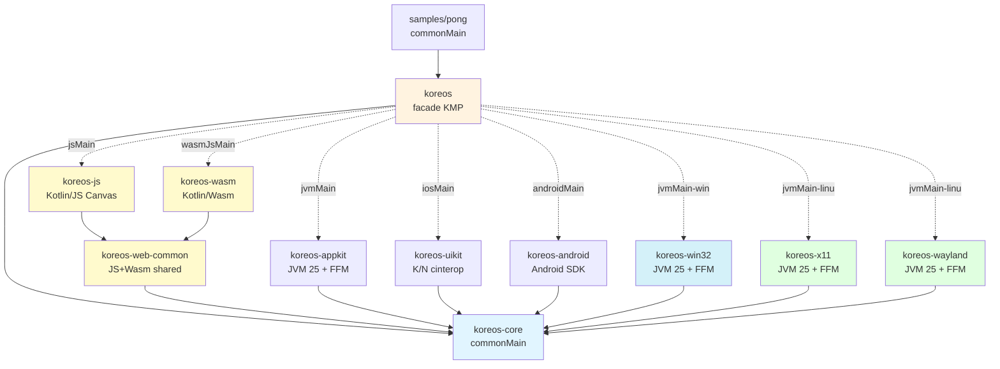
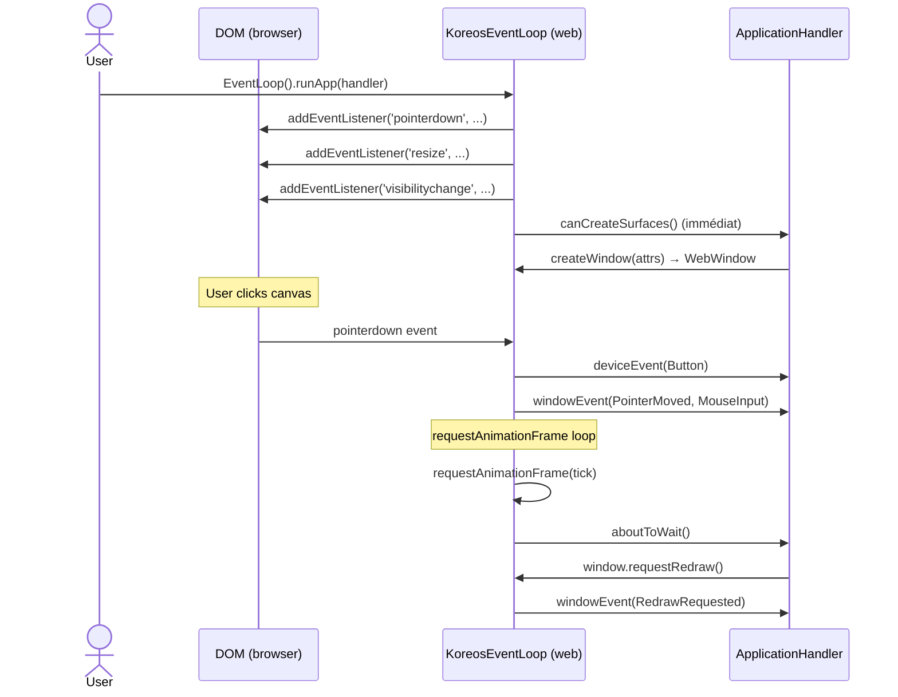
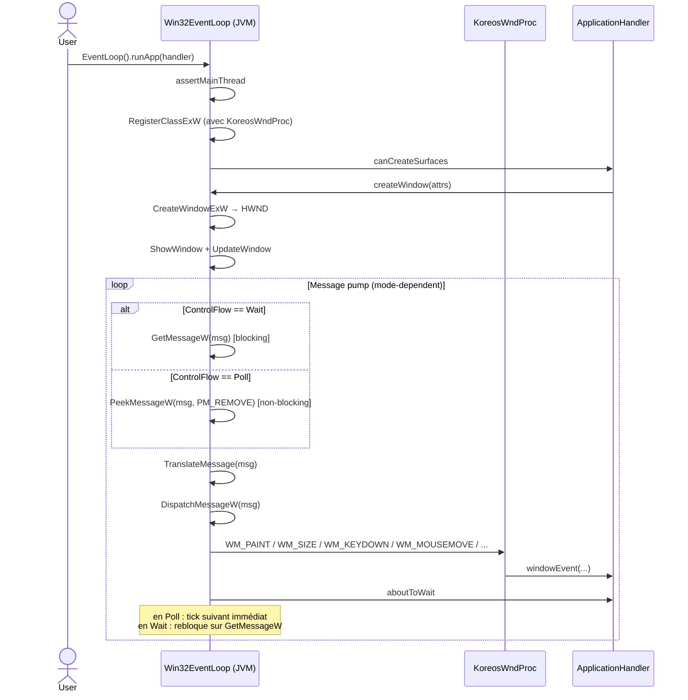
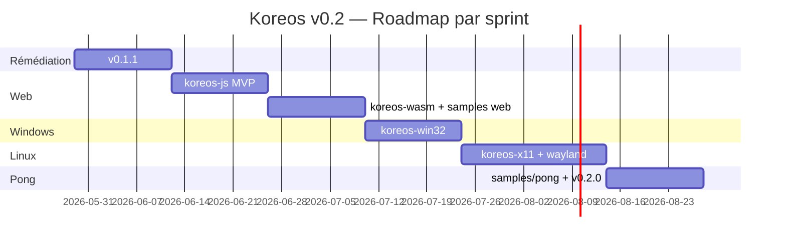

# Koreos — Spécifications techniques v0.2

> Statut : **Draft v2 — révision review PR #49 intégrée**
> Document de référence pour l'implémentation des Sprints 0 → 5 décrits dans [plan-v0.2](./plan-v0.2.md).
> Document précédent : [specs v0.1](./specs.md) — référence pour macOS, iOS, Android (déjà livré).

Ce document **complète** specs v0.1 — il ne remplace pas. Les sections inchangées (§3 API publique, §4 modèle d'événements, §5 boucle d'événements, §7 threading model) sont valides telles quelles. Seules les nouveautés v0.2 sont décrites ci-après.

**Corrections review v2 (PR #49)** :
- §2.1 — `RawWindowHandle.Web` accepte `canvasElement` direct (Shadow DOM, SPA frameworks)
- §3.1.3 — Mode `Wait` sur Web : RAF unique au lieu de boucle continue
- §3.2.2 — Win32 : `PeekMessageW` en `Poll`, `GetMessageW` en `Wait`
- §3.2.7 — Win32 : `Arena.ofShared` pour WndProc upcall stub (durée = processus)
- §3.3.2 — X11 : `XPending` + `XNextEvent` en `Poll`, `select` en `WaitUntil`
- §3.4.2 — Wayland : `wl_display_prepare_read` + `poll` non-bloquant + `eventfd` pour wakeUp
- §3.5 — Détection Linux : chargement paresseux des symboles FFM + try/catch `Throwable`

---

## 1. Architecture v0.2 — mise à jour modulaire

### 1.1 Diagramme des modules étendu



### 1.2 Stratégies de binding v0.2

| Module | Cibles KMP | Binding | Lib native ? |
|--------|------------|---------|--------------|
| `koreos-web-common` | jsMain, wasmJsMain | — (Kotlin pur) | non |
| `koreos-js` | jsMain (browser) | JS DOM via `kotlin-wrappers-browser` ou similaire | non |
| `koreos-wasm` | wasmJsMain (browser) | JS interop Wasm vers DOM | non |
| `koreos-win32` | jvm (Windows-specific) | kextract FFM Win32 (User32, Gdi32, Kernel32) | non |
| `koreos-x11` | jvm (Linux-specific) | kextract FFM Xlib + XInput2 | non |
| `koreos-wayland` | jvm (Linux-specific) | kextract FFM libwayland-client + xdg_shell | non |
| `koreos` (facade) | toutes (6 plateformes) | expect/actual | non |

**Découplage Linux** : `koreos-x11` et `koreos-wayland` sont deux **modules séparés**, comme `koreos-appkit` et `koreos-uikit`. La facade contient une **logique de sélection runtime** dans le sourceSet `linuxMain` qui choisit le backend au démarrage.

---

## 2. API publique — ajouts v0.2

### 2.1 Nouveaux variants `RawWindowHandle`

```kotlin
sealed interface RawWindowHandle {
    // Existants v0.1
    data class AppKit(val nsView: Long, val nsWindow: Long, val nsLayer: Long) : RawWindowHandle
    data class UiKit(val uiView: Long, val uiViewController: Long?) : RawWindowHandle
    data class Android(val surface: Any) : RawWindowHandle

    // Nouveaux v0.2
    /**
     * Web : référence vers le canvas HTML auquel attacher la wgpu.Surface.
     *
     * Deux modes mutuellement exclusifs :
     * - `canvasElementId` : id à résoudre via `document.getElementById` (cas simple, page statique).
     * - `canvasElement` : référence directe (HTMLCanvasElement côté JS, équivalent côté Wasm).
     *   Indispensable pour les frameworks SPA (Compose HTML, React/Vue/Angular)
     *   et les canvas dans un Shadow DOM (invisibles à `getElementById`).
     *
     * Au moins l'un des deux doit être non-null. Si les deux sont fournis, `canvasElement`
     * a priorité.
     */
    data class Web(
        val canvasElementId: String? = null,
        val canvasElement: Any? = null,
    ) : RawWindowHandle {
        init {
            require(canvasElementId != null || canvasElement != null) {
                "RawWindowHandle.Web requires either canvasElementId or canvasElement"
            }
        }
    }

    /** Windows : HWND + HINSTANCE en Long. */
    data class Win32(val hwnd: Long, val hinstance: Long) : RawWindowHandle

    /** Linux X11 : Window handle (XID) + Display pointer. */
    data class Xlib(val window: Long, val display: Long) : RawWindowHandle

    /** Linux Wayland : wl_surface + wl_display pointers. */
    data class Wayland(val surface: Long, val display: Long) : RawWindowHandle
}
```

### 2.2 Nouveaux variants `RawDisplayHandle`

```kotlin
sealed interface RawDisplayHandle {
    // Existants
    object AppKit : RawDisplayHandle
    object UiKit : RawDisplayHandle
    object Android : RawDisplayHandle

    // Nouveaux
    object Web : RawDisplayHandle
    data class Win32(val hinstance: Long) : RawDisplayHandle
    data class Xlib(val display: Long) : RawDisplayHandle
    data class Wayland(val display: Long) : RawDisplayHandle
}
```

### 2.3 Rétro-compatibilité

- **Aucune** signature d'interface existante n'est modifiée.
- Seules des sealed interface **variants** sont ajoutés (extension safe pour les consommateurs qui font `when` exhaustif → ils devront recompiler mais leur code restera valide après ajout des branches manquantes).
- Le tag `v0.1.x` reste compatible source avec `v0.2.x` sauf pour les consommateurs qui font un `when` exhaustif sur `RawWindowHandle` (cas attendu : renderer wgpu4k).

---

## 3. Considérations spécifiques par nouvelle plateforme

### 3.1 Web (koreos-js + koreos-wasm + koreos-web-common)

#### 3.1.1 Architecture commune

`koreos-web-common` héberge :
- Mapping `DOMEvent → WindowEvent` (PointerEvent, KeyboardEvent, etc.)
- Lifecycle DOM (`visibilitychange`, `pagehide`/`pageshow`)
- Gestion du `<canvas>` HTML (resize via ResizeObserver, devicePixelRatio)
- Interface `WebDomBridge` abstraite (actual JS / actual Wasm)

`koreos-js` et `koreos-wasm` n'implémentent que la **bridge** DOM (interop JS spécifique).

#### 3.1.2 Boucle d'événements Web

Il n'y a pas de "main thread" sur Web — le JS runtime est mono-thread par défaut. La boucle d'événements est :



**`runApp()` ne bloque pas sur Web** : il enregistre les listeners DOM + démarre le `requestAnimationFrame` loop, puis retourne. La page reste vivante via le `requestAnimationFrame` loop.

**Implication** : sur Web, `runApp` n'a pas la même sémantique que sur Desktop. Documenter explicitement.

#### 3.1.3 ControlFlow sur Web

- `Wait` : **aucune** boucle `requestAnimationFrame` continue. Les events DOM (input, resize, visibilitychange) réveillent la boucle. Quand `requestRedraw()` est appelé depuis un handler en mode Wait, **un seul `requestAnimationFrame(tick)` est planifié** pour produire la frame, puis l'app retourne au repos. Préserve CPU et batterie (critique mobile/laptop).
- `Poll` : `requestAnimationFrame` continu, ré-enchaîné à chaque tick (60Hz cap navigateur, 120Hz sur écrans ProMotion).
- `WaitUntil(deadline)` : `setTimeout(deadline - now)` qui déclenche un unique `requestAnimationFrame` à expiration.

**Coalescing** : un flag `rafScheduled` empêche d'enregistrer plusieurs RAF concurrents pour un même tick. Appels multiples à `requestRedraw()` entre deux frames → un seul RAF.

`EventLoopProxy.wakeUp()` côté Web : poste un event custom dans la queue via `queueMicrotask` (ou `setTimeout(0)` fallback). Coalescing identique via flag.

#### 3.1.4 Mapping events Web

| DOM event | Koreos event |
|-----------|--------------|
| `pointerdown`/`pointerup` | `WindowEvent.MouseInput` (mouse) OU `WindowEvent.Touch` (touch) selon `pointerType` |
| `pointermove` | `WindowEvent.PointerMoved` |
| `keydown`/`keyup` | `WindowEvent.KeyboardInput` (mapping `code` → `Key` enum) |
| `wheel` | `WindowEvent.MouseWheel` |
| `resize` (window) | `WindowEvent.Resized` (via ResizeObserver sur canvas) |
| `visibilitychange` | `suspended` (hidden) / `resumed` (visible) |
| `pagehide` | `suspended` |

#### 3.1.5 DPI (devicePixelRatio)

- `Window.scaleFactor()` → `window.devicePixelRatio` (typiquement 1.0, 2.0, 3.0)
- `Window.innerSize()` retourne **physical pixels** = `canvas.clientWidth × devicePixelRatio`
- Canvas attribut `width`/`height` doit être ajusté en physical pour éviter le blur
- Changement de zoom navigateur → `WindowEvent.ScaleFactorChanged`

#### 3.1.6 Sample `samples/hello-triangle-web`

- Page HTML statique avec `<canvas id="koreos-canvas">`
- Bundle Kotlin/JS ou Kotlin/Wasm chargé via `<script>`
- wgpu4k attache sa Surface au canvas via le `RawWindowHandle.Web("koreos-canvas")`
- Build : Gradle task `:samples:hello-triangle-web:browserDistribution` produit un dossier statique servable
- CI : upload du dossier sur GitHub Pages pour démos live

#### 3.1.7 Limitations Web

- Pas de multi-fenêtre (un canvas par page, multi-tabs = multi-instances de la lib)
- Pas de `setTitle()` direct (option : `document.title`)
- Pas de raw input mouse (la souverainté curseur appartient au navigateur)
- IME : si nécessaire post-v0.2, via `<input>` hidden overlay

---

### 3.2 Windows (koreos-win32)

#### 3.2.1 Stack

- kextract FFM JVM 25 sur `user32.dll`, `gdi32.dll`, `kernel32.dll`, `dwmapi.dll`
- Pattern Win32 standard : `RegisterClassExW` + `CreateWindowExW` + WndProc + message pump (`GetMessage`/`TranslateMessage`/`DispatchMessage`)
- Subclassing : pas applicable Win32 ; on instancie une `WNDCLASSEXW` custom avec notre WndProc

#### 3.2.2 Boucle d'événements



**⚠️ Critique** — Le choix `GetMessageW` vs `PeekMessageW` est **commuté à chaque tick** selon le `ControlFlow` en vigueur :

- **`ControlFlow.Wait`** : `GetMessageW(msg, ...)` — bloquant. Le thread dort jusqu'à un message Windows ou un `PostMessage(hwnd, WM_USER_WAKEUP, 0, 0)` envoyé par `EventLoopProxy.wakeUp`.
- **`ControlFlow.Poll`** : `PeekMessageW(msg, ..., PM_REMOVE)` — non-bloquant. Si pas de message, le tick suivant démarre immédiatement (game loop continu). Indispensable pour Pong et tout sample avec animation continue, sinon le rendu fige dès l'arrêt des inputs utilisateur.
- **`ControlFlow.WaitUntil(deadline)`** : `MsgWaitForMultipleObjectsEx(deadline - now)` qui combine attente bloquante avec timeout.

`EventLoopProxy.wakeUp()` Win32 : `PostThreadMessageW(threadId, WM_USER_WAKEUP, 0, 0)` thread-safe sur le thread du message pump. Coalescing via flag atomique côté Kotlin.

#### 3.2.3 Mapping messages

| Message Win32 | Koreos event |
|---------------|--------------|
| `WM_PAINT` | `WindowEvent.RedrawRequested` |
| `WM_SIZE` | `WindowEvent.Resized(PhysicalSize)` |
| `WM_DPICHANGED` | `WindowEvent.ScaleFactorChanged` |
| `WM_KEYDOWN`/`WM_KEYUP` | `WindowEvent.KeyboardInput` |
| `WM_LBUTTONDOWN`/`WM_LBUTTONUP` | `WindowEvent.MouseInput(Left)` |
| `WM_MOUSEMOVE` | `WindowEvent.PointerMoved` |
| `WM_MOUSEWHEEL` | `WindowEvent.MouseWheel` |
| `WM_DESTROY` | `WindowEvent.Destroyed` puis `eventLoop.exit()` candidat |
| `WM_CLOSE` | `WindowEvent.CloseRequested` |
| `WM_SETFOCUS`/`WM_KILLFOCUS` | `WindowEvent.Focused` |
| `WM_INPUT` (raw input) | `DeviceEvent.*` (post-v0.2 optionnel) |

#### 3.2.4 DPI awareness

- Manifest application : `dpiAwareness = PerMonitorV2` (via `SetProcessDpiAwarenessContext` au démarrage)
- `Window.scaleFactor()` → `GetDpiForWindow(hwnd) / 96.0`
- `WM_DPICHANGED` reconfigure layer + dispatch ScaleFactorChanged

#### 3.2.5 RawWindowHandle

```kotlin
fun rawWindowHandle(): RawWindowHandle = RawWindowHandle.Win32(
    hwnd = hwndValue,
    hinstance = hInstanceValue
)
```

#### 3.2.6 EventLoopProxy.wakeUp Windows

- Thread-safe : `PostThreadMessageW(threadId, WM_USER_WAKEUP, 0, 0)` depuis tout thread (cf. §3.2.2 — préféré à `PostMessage` car ne nécessite pas un HWND vivant)
- Le message custom est interpreté dans WndProc comme un no-op qui réveille la queue
- Coalescing : flag atomique côté Kotlin, on ignore les wakeups si une wakeup est déjà en queue

#### 3.2.7 ⚠️ Durée de vie de l'Arena FFM pour WndProc

**Critique sécurité runtime** — En FFM, le `WndProc` Kotlin exposé comme pointeur de fonction natif est un *upcall stub* lié à une `Arena`. **Si l'Arena est fermée avant que Windows ait fini de distribuer ses messages**, le prochain appel `WndProc` déclenche un `SIGSEGV` immédiat.

Règles de durée de vie à respecter strictement :

| Ressource | Arena dédiée | Cycle de vie |
|---|---|---|
| `KoreosWndProc` (fonction Kotlin → pointeur natif) | `Arena.ofShared()` (lifetime = processus) | Allouée une seule fois au premier `RegisterClassExW`. **Jamais fermée**. |
| HWND propre à une fenêtre | `Arena.ofConfined()` (lifetime = fenêtre) | Allouée à `CreateWindowExW`, fermée seulement après que `WM_NCDESTROY` ait été traité (dernier message d'une fenêtre selon doc Microsoft). |
| Allocations temporaires (struct paramètres, strings UTF-16) | `Arena.ofConfined()` locale à la méthode | Fermée à la fin de la méthode (try-with-resources Kotlin via `use`). |

Pattern d'implémentation :

```kotlin
internal object Win32WndProcArena {
    // Arena partagée, jamais fermée — durée du processus
    val arena: Arena = Arena.ofShared()

    val wndProcStub: MemorySegment by lazy {
        Linker.nativeLinker().upcallStub(
            MethodHandles.lookup().findStatic(
                KoreosWndProc::class.java, "dispatch", DISPATCH_DESCRIPTOR
            ),
            FunctionDescriptor.of(C_LONG, C_POINTER, C_INT, C_LONG, C_LONG),
            arena,
        )
    }
}
```

**Ne jamais** mettre l'Arena WndProc dans une fenêtre ou un EventLoop scopé : si l'utilisateur ferme toutes ses fenêtres puis en rouvre une, l'ancien stub doit rester valide pour gérer les messages de fermeture en cours de queue.

---

### 3.3 Linux X11 (koreos-x11)

#### 3.3.1 Stack

- kextract FFM Xlib + XInput2 (pour multi-touch et raw input si présent)
- Pattern : `XOpenDisplay` + `XCreateWindow` + `XSelectInput` + `XNextEvent` loop

#### 3.3.2 Boucle d'événements

`XNextEvent` est bloquant. Le mode doit être commuté selon `ControlFlow` pour éviter de figer le rendu en mode `Poll` (cas Pong).

- **`ControlFlow.Wait`** : appel direct `XNextEvent(display, &event)` — bloque jusqu'à un event natif ou un wakeup `XSendEvent(_KOREOS_WAKEUP)`.
- **`ControlFlow.Poll`** : avant d'appeler `XNextEvent`, vérifier `XPending(display) > 0`. Si zéro événement en attente, ne pas bloquer et passer directement à `aboutToWait` puis au tick suivant. Combiné avec `XFlush(display)` pour s'assurer que les requêtes sortantes sont envoyées.
- **`ControlFlow.WaitUntil(deadline)`** : utiliser `select`/`poll` sur le file descriptor X11 (`ConnectionNumber(display)`) avec un timeout égal à `deadline - now`. Quand `select` retourne, traiter les events disponibles via la boucle Poll-style.

```kotlin
// pseudo-code
fun pumpEvents(controlFlow: ControlFlow) {
    when (controlFlow) {
        ControlFlow.Wait -> { XNextEvent(display, eventBuf); dispatch(eventBuf) }
        ControlFlow.Poll -> {
            XFlush(display)
            while (XPending(display) > 0) { XNextEvent(display, eventBuf); dispatch(eventBuf) }
        }
        is ControlFlow.WaitUntil -> {
            XFlush(display)
            val fd = ConnectionNumber(display)
            select(fd, timeout = controlFlow.deadline - now())
            while (XPending(display) > 0) { XNextEvent(display, eventBuf); dispatch(eventBuf) }
        }
    }
}
```

`EventLoopProxy.wakeUp` thread-safe : `XSendEvent(display, window, false, NoEventMask, &koreosWakeupEvent)` + `XFlush(display)`. Coalescing via flag atomique.

#### 3.3.3 Mapping events

| X11 event | Koreos event |
|-----------|--------------|
| `Expose` | `WindowEvent.RedrawRequested` |
| `ConfigureNotify` | `WindowEvent.Resized` + `Moved` selon delta |
| `KeyPress`/`KeyRelease` | `WindowEvent.KeyboardInput` (via XLookupString pour le mapping) |
| `ButtonPress`/`ButtonRelease` | `WindowEvent.MouseInput` |
| `MotionNotify` | `WindowEvent.PointerMoved` |
| `EnterNotify`/`LeaveNotify` | `WindowEvent.PointerEntered`/`PointerLeft` |
| `FocusIn`/`FocusOut` | `WindowEvent.Focused` |
| `ClientMessage` (WM_DELETE_WINDOW) | `WindowEvent.CloseRequested` |
| `DestroyNotify` | `WindowEvent.Destroyed` |

#### 3.3.4 RawWindowHandle

```kotlin
fun rawWindowHandle(): RawWindowHandle = RawWindowHandle.Xlib(
    window = windowXid,
    display = displayPointer
)
```

#### 3.3.5 DPI

X11 ne gère pas le DPI scaling au niveau protocole. Lecture du DPI :
- `Xft.dpi` resource via `XGetDefault` → fallback heuristique 96
- Sample n'expose qu'un seul `scaleFactor` global (pas de per-monitor)

---

### 3.4 Linux Wayland (koreos-wayland)

#### 3.4.1 Stack

- kextract FFM `libwayland-client`
- Protocoles : `wl_display`, `wl_registry`, `wl_compositor`, `wl_surface`, `xdg_shell` (xdg_wm_base + xdg_surface + xdg_toplevel), `xdg_decoration_unstable_v1`
- Bindings xdg via wayland-scanner (.xml → C → kextract → Kotlin)

#### 3.4.2 Boucle d'événements

Wayland est event-driven asynchrone. La séquence canonique pour supporter `Wait` ET `Poll` sans figer :

1. `wl_display_prepare_read(display)` — annonce l'intention de lire (thread-safe, sans bloquer).
2. `wl_display_flush(display)` — envoie les requêtes Kotlin en attente.
3. **`poll`** (Linux syscall) sur `wl_display_get_fd(display)` avec un timeout dépendant du `ControlFlow` :
   - `ControlFlow.Wait` → timeout `-1` (bloquant infini)
   - `ControlFlow.Poll` → timeout `0` (non-bloquant)
   - `ControlFlow.WaitUntil(deadline)` → timeout `deadline - now` en ms
4. Si `poll` indique des données → `wl_display_read_events(display)` (consomme du fd) puis `wl_display_dispatch_pending(display)` (déclenche les listeners Wayland qui dispatcheront vers notre `ApplicationHandler`).
5. Si `poll` n'a rien (cas Poll sans events) → `wl_display_cancel_read(display)` pour libérer la déclaration.

```kotlin
// pseudo-code
fun pumpEvents(controlFlow: ControlFlow) {
    while (wl_display_prepare_read(display) != 0) {
        wl_display_dispatch_pending(display)  // queue déjà non vide, consommer
    }
    wl_display_flush(display)

    val timeoutMs = when (controlFlow) {
        ControlFlow.Wait -> -1
        ControlFlow.Poll -> 0
        is ControlFlow.WaitUntil -> max(0, controlFlow.deadline - now()).toMillis()
    }
    val pollResult = poll(wl_display_get_fd(display), timeoutMs)

    if (pollResult > 0) {
        wl_display_read_events(display)
        wl_display_dispatch_pending(display)
    } else {
        wl_display_cancel_read(display)
    }
}
```

`EventLoopProxy.wakeUp` Wayland : écrire 1 octet sur un `eventfd(0, EFD_NONBLOCK | EFD_CLOEXEC)` ajouté au `poll` ci-dessus comme deuxième fd. Coalescing par sémantique eventfd (compteur 64-bit, drainé d'un seul `read` côté boucle).

#### 3.4.3 Mapping events

| Wayland event | Koreos event |
|---------------|--------------|
| `xdg_surface.configure` | `WindowEvent.Resized` + ack configure |
| `xdg_toplevel.close` | `WindowEvent.CloseRequested` |
| `wl_pointer.motion` | `WindowEvent.PointerMoved` |
| `wl_pointer.button` | `WindowEvent.MouseInput` |
| `wl_pointer.axis` | `WindowEvent.MouseWheel` |
| `wl_keyboard.key` | `WindowEvent.KeyboardInput` (via libxkbcommon mapping) |
| `wl_keyboard.enter`/`leave` | `WindowEvent.Focused` |
| `wl_touch.down`/`up`/`motion` | `WindowEvent.Touch` |
| `wl_output.scale` | `WindowEvent.ScaleFactorChanged` (per-output scale) |

#### 3.4.4 RawWindowHandle

```kotlin
fun rawWindowHandle(): RawWindowHandle = RawWindowHandle.Wayland(
    surface = wlSurfacePointer,
    display = wlDisplayPointer
)
```

#### 3.4.5 Décorations

- `xdg_decoration_unstable_v1` pour demander des server-side decorations
- Si non supporté → client-side decorations minimales (titre bar simple) ou fallback "no decorations" + raccourci clavier pour close

---

### 3.5 Détection automatique X11 vs Wayland

#### 3.5.1 ⚠️ Chargement paresseux des symboles natifs

**Critique** — La référence directe aux classes `X11EventLoop` et `WaylandEventLoop` dans le code de détection ne doit **pas** déclencher la résolution FFM des bibliothèques natives (`libwayland-client.so`, `libX11.so`). Sur un système Linux Wayland pur (sans XWayland), `libX11.so` peut être absente — un `SymbolLookup.libraryLookup("X11")` dans un `companion object` ou `init` lèverait alors `UnsatisfiedLinkError`/`LinkageError` au simple chargement de classe, **avant même la branche de détection**, et crasherait l'app.

Règles d'implémentation :

1. **Aucune résolution FFM dans `companion object`, `init`, ou propriété de classe non-`lazy`** sur `X11EventLoop` et `WaylandEventLoop`.
2. Tous les symboles natifs sont chargés via `lazy { ... }` ou à l'intérieur de méthodes appelées **après** la décision de backend.
3. La phase de "test de disponibilité" se fait via une méthode `tryProbe()` isolée qui charge la lib dans un try/catch large.
4. Le try/catch attrape `Throwable` (pas juste `Exception`) pour intercepter `LinkageError`, `UnsatisfiedLinkError`, `ExceptionInInitializerError`, `NoClassDefFoundError`.

#### 3.5.2 Pattern de détection

```kotlin
// koreos/jvmMain (cible linux)
actual class EventLoop {
    actual fun runApp(handler: ApplicationHandler) {
        val backend = detectBackend()
        backend.runApp(handler)
    }
}

private fun detectBackend(): EventLoop {
    // 1. Override explicite via env var → priorité absolue
    when (System.getenv("KOREOS_LINUX_BACKEND")?.lowercase()) {
        "wayland" -> return WaylandEventLoop.createOrThrow()
        "x11" -> return X11EventLoop.createOrThrow()
        null, "" -> { /* auto */ }
        else -> error("Invalid KOREOS_LINUX_BACKEND value (use 'wayland' or 'x11')")
    }

    // 2. Auto-détection via XDG_SESSION_TYPE (hint Wayland/X11 par le compositor)
    val xdgSessionType = System.getenv("XDG_SESSION_TYPE")?.lowercase()
    if (xdgSessionType == "wayland") {
        tryCreate { WaylandEventLoop.createOrThrow() }?.let { return it }
    }
    if (xdgSessionType == "x11") {
        tryCreate { X11EventLoop.createOrThrow() }?.let { return it }
    }

    // 3. Probe runtime : tenter Wayland (moderne) puis X11 (legacy)
    tryCreate { WaylandEventLoop.createOrThrow() }?.let { return it }
    tryCreate { X11EventLoop.createOrThrow() }?.let { return it }

    error("""
        Aucun backend Linux disponible (ni Wayland ni X11).
        Vérifie que libwayland-client.so OU libX11.so est installé.
        Override possible via KOREOS_LINUX_BACKEND=wayland|x11.
    """.trimIndent())
}

/** Try/catch très large : LinkageError, UnsatisfiedLinkError, ExceptionInInitializerError, etc. */
private inline fun tryCreate(block: () -> EventLoop): EventLoop? = try {
    block()
} catch (t: Throwable) {
    // Log debug si KOREOS_DEBUG=1
    if (System.getenv("KOREOS_DEBUG") == "1") {
        System.err.println("Backend probe failed: ${t::class.simpleName}: ${t.message}")
    }
    null
}

/** Côté X11EventLoop / WaylandEventLoop : factory qui ne crée l'Arena FFM qu'à l'appel. */
internal object WaylandEventLoop {
    fun createOrThrow(): EventLoop {
        // C'est ICI que la résolution FFM des symboles a lieu, pas avant.
        // wl_display_connect renvoie NULL si pas de serveur Wayland → on throw.
        val display = WaylandSymbols.wl_display_connect(null)
            ?: throw IllegalStateException("wl_display_connect returned NULL")
        return WaylandEventLoopImpl(display)
    }
}
```

#### 3.5.3 Critère "Wayland disponible"

`WaylandEventLoop.createOrThrow()` retourne sans erreur uniquement si :
- `libwayland-client.so.0` est chargeable.
- `wl_display_connect(NULL)` retourne un display non-null (= variable `WAYLAND_DISPLAY` valide ET socket fonctionnel).

Sinon → fallback X11 ou erreur finale.

---

## 4. Architecture du sample Pong (Sprint 5)

### 4.1 Structure

```
samples/pong/
├── build.gradle.kts (KMP avec 6 targets)
├── src/
│   ├── commonMain/kotlin/.../
│   │   ├── PongGame.kt           # ApplicationHandler principal
│   │   ├── GameState.kt          # Data classes : Paddle, Ball, Score
│   │   ├── PongAi.kt             # IA simple
│   │   ├── PongRenderer.kt       # Rendu wgpu4k (quads + texte)
│   │   ├── InputAdapter.kt       # Mapping WindowEvent → action paddle (clavier / touch)
│   │   └── BitmapFont.kt         # Petit bitmap font hardcodé pour le score
│   ├── jvmMain/   (entry point Desktop : macOS, Windows, Linux)
│   ├── iosMain/   (entry point UIApplicationMain)
│   ├── androidMain/  (entry point Activity)
│   ├── jsMain/    (entry point JS : window load)
│   └── wasmJsMain/  (entry point Wasm)
```

### 4.2 PongGame en commonMain

```kotlin
class PongGame : ApplicationHandler {
    private var window: Window? = null
    private var renderer: PongRenderer? = null
    private var state = GameState.initial()
    private val ai = PongAi(reactionLagMs = 80)
    private val inputAdapter = InputAdapter()
    private var lastFrameTime = 0L

    override fun canCreateSurfaces(eventLoop: ActiveEventLoop) {
        window = eventLoop.createWindow(WindowAttributes(title = "Koreos Pong"))
        renderer = PongRenderer(window!!.rawWindowHandle())
        eventLoop.setControlFlow(ControlFlow.Poll)
    }

    override fun windowEvent(eventLoop: ActiveEventLoop, windowId: WindowId, event: WindowEvent) {
        when (event) {
            is WindowEvent.CloseRequested -> eventLoop.exit()
            is WindowEvent.RedrawRequested -> draw()
            is WindowEvent.Resized -> renderer?.resize(event.size)
            is WindowEvent.KeyboardInput -> inputAdapter.onKey(event)
            is WindowEvent.Touch -> inputAdapter.onTouch(event, window!!.innerSize())
            else -> {}
        }
    }

    override fun aboutToWait(eventLoop: ActiveEventLoop) {
        val now = currentTimeNanos()
        val dt = (now - lastFrameTime).coerceIn(0, 50_000_000) / 1e9  // sec, capé 50ms
        lastFrameTime = now
        state = state.tick(dt, inputAdapter.playerInput, ai.suggest(state, dt))
        window?.requestRedraw()
    }

    private fun draw() {
        renderer?.draw(state)
    }
}
```

### 4.3 IA simple

```kotlin
class PongAi(private val reactionLagMs: Long) {
    private var lastTargetY = 0.0
    private var lastUpdate = 0L

    fun suggest(state: GameState, dt: Double): PaddleInput {
        val now = currentTimeNanos()
        if ((now - lastUpdate) / 1_000_000 > reactionLagMs) {
            lastTargetY = state.ball.y
            lastUpdate = now
        }
        val paddle = state.aiPaddle
        return when {
            paddle.y < lastTargetY - 0.05 -> PaddleInput.Down
            paddle.y > lastTargetY + 0.05 -> PaddleInput.Up
            else -> PaddleInput.None
        }
    }
}
```

### 4.4 Mapping input cross-platform

```kotlin
class InputAdapter {
    var playerInput = PaddleInput.None
        private set

    fun onKey(event: WindowEvent.KeyboardInput) {
        playerInput = when (event.key to event.state) {
            Key.ArrowUp to KeyState.Pressed -> PaddleInput.Up
            Key.ArrowDown to KeyState.Pressed -> PaddleInput.Down
            else -> if (event.state == KeyState.Released) PaddleInput.None else playerInput
        }
    }

    fun onTouch(event: WindowEvent.Touch, screenSize: PhysicalSize<Int>) {
        // Zone droite de l'écran : touch en haut = up, en bas = down
        val rightZone = event.location.x > screenSize.width / 2.0
        if (!rightZone) return
        playerInput = when (event.phase) {
            TouchPhase.Started, TouchPhase.Moved -> {
                if (event.location.y < screenSize.height / 2.0) PaddleInput.Up
                else PaddleInput.Down
            }
            TouchPhase.Ended, TouchPhase.Cancelled -> PaddleInput.None
        }
    }
}
```

### 4.5 Rendu wgpu4k

- Pipeline 2D simple : 1 vertex shader (transform position), 1 fragment shader (couleur uniforme)
- 5 draw calls par frame :
  - 2 quads pour les raquettes (couleur blanche)
  - 1 quad pour la balle (couleur blanche)
  - N quads pour les chiffres du score (bitmap font, blocs blancs)
  - 1 quad pour la ligne pointillée du milieu (option)
- Clear color noir
- Présentation à `surface.present()`

### 4.6 Frame timing

- `ControlFlow.Poll` → `aboutToWait` à chaque tick
- `dt` calculé en commonMain via `currentTimeNanos()` (expect/actual : `System.nanoTime` JVM, `performance.now()` Web, `mach_absolute_time` Apple, `clock_gettime` Linux/Android)
- Capé à 50ms pour éviter les sauts énormes au resume

### 4.7 Considérations par plateforme

| Plateforme | Spécifique |
|------------|-----------|
| Desktop (macOS/Windows/Linux) | Flèches ↑↓. Window 800×600. |
| Mobile (iOS/Android) | Touch zone droite. Window plein écran. |
| Web | Flèches ↑↓ (clavier) **+** touch zone droite (tactile). Canvas plein conteneur. |

---

## 5. Stratégie CI v0.2

### 5.1 Jobs ajoutés

| Job | Runner | Tâches |
|-----|--------|--------|
| `web-build` | `ubuntu-latest` + Node | `:koreos-js:build`, `:koreos-wasm:build`, `:samples:hello-triangle-web:browserProductionWebpack` |
| `windows-build` | `windows-latest` | `:koreos-win32:build`, `:samples:hello-triangle:run` (smoke test) |
| `linux-x11-build` | `ubuntu-latest` + Xvfb | `:koreos-x11:build`, `:samples:hello-triangle:build` |
| `linux-wayland-build` | `ubuntu-latest` + weston headless | `:koreos-wayland:build`, sample smoke |

### 5.2 Workflow conditionnel

- **Fast-Track JVM** (branches secondaires) : `:koreos-core:jvmTest` uniquement, < 10s.
- **Deep-Testing** (PR vers master) : tous les jobs ci-dessus.
- **Release** (tag `v*`) : Deep-Testing + Maven Central publish.

---

## 6. Roadmap d'implémentation v0.2 (résumé)



---

## 7. Limitations connues v0.2

- Pas de multi-fenêtre Web (un canvas par instance lib)
- Pas de multi-touch X11 sans XInput2 — à activer si présent
- Wayland nécessite `xdg_shell` v3+ (compositors >=2020)
- Pas de gamepad input (post-v0.2)
- Pas d'IME / composition (post-v0.2)
- Pong : pas d'audio, pas de réseau, IA basique

---

## 8. Annexes

### Mapping winit → Koreos v0.2

| winit (Rust) | Koreos v0.2 |
|--------------|------------------|
| `RawWindowHandle::Web` | `RawWindowHandle.Web(canvasElementId: String)` |
| `RawWindowHandle::Win32` | `RawWindowHandle.Win32(hwnd, hinstance)` |
| `RawWindowHandle::Xlib` | `RawWindowHandle.Xlib(window, display)` |
| `RawWindowHandle::Wayland` | `RawWindowHandle.Wayland(surface, display)` |
| `winit-web` crate | `koreos-js` + `koreos-wasm` + `koreos-web-common` |
| `winit-win32` crate | `koreos-win32` |
| `winit-x11` crate | `koreos-x11` |
| `winit-wayland` crate | `koreos-wayland` |

### Références externes additionnelles

- [WebGPU spec](https://www.w3.org/TR/webgpu/)
- [Kotlin/Wasm browser interop](https://kotlinlang.org/docs/wasm-overview.html)
- [Win32 API — Window classes](https://learn.microsoft.com/en-us/windows/win32/winmsg/window-classes)
- [Xlib programming manual](https://www.x.org/releases/X11R7.7/doc/libX11/libX11/libX11.html)
- [Wayland protocol](https://wayland.app/protocols/wayland)
- [xdg-shell unstable](https://wayland.app/protocols/xdg-shell)
- [libxkbcommon (Linux keymap)](https://xkbcommon.org/)

### Documents associés

- [Plan projet v0.2](./plan-v0.2.md)
- [Plan v0.1 (livré)](./plan.md)
- [Specs v0.1 (livrées)](./specs.md)
