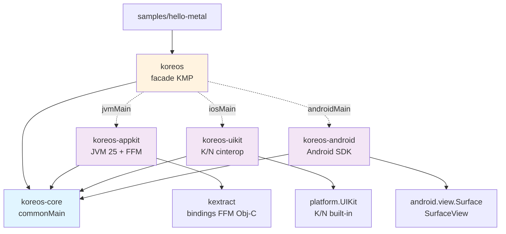
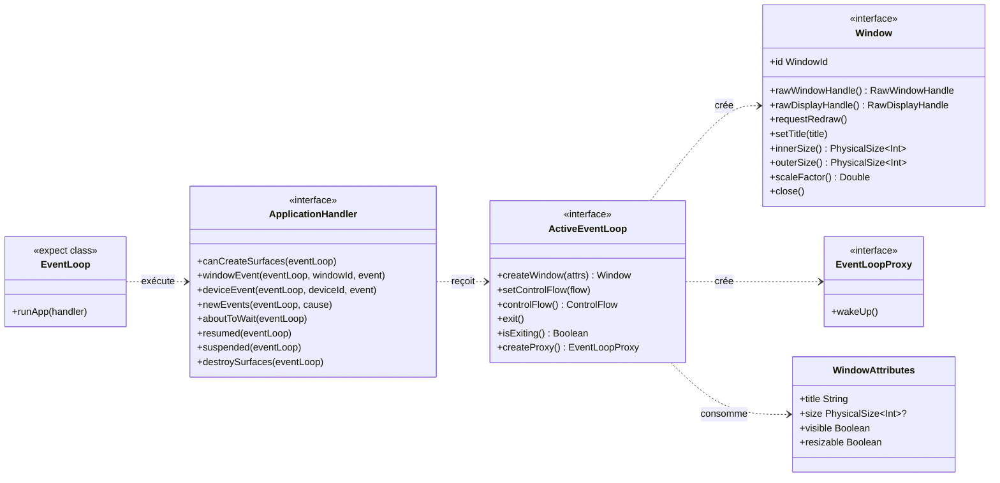
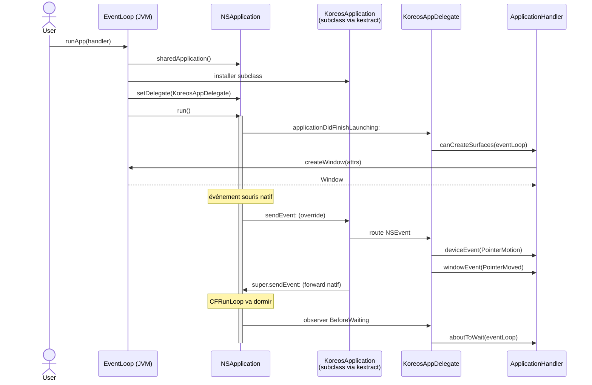
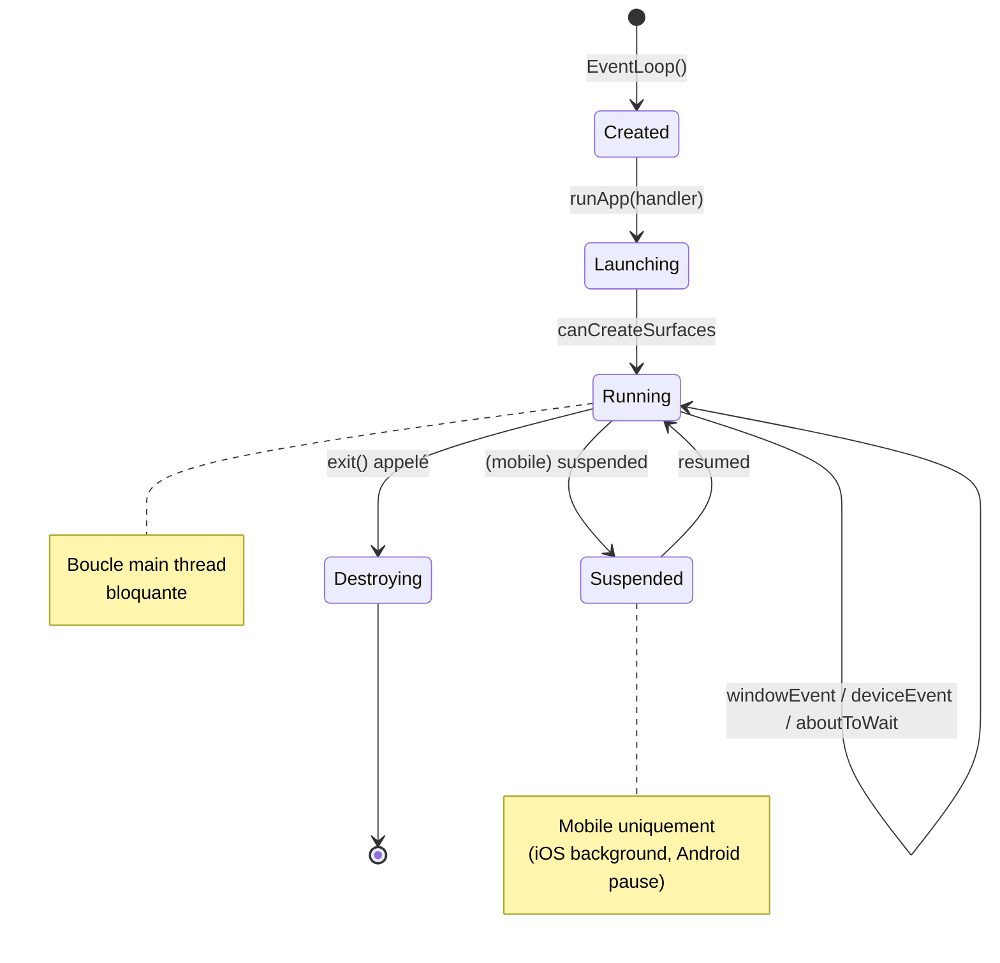

# Koreos — Spécifications techniques

> Statut : **Draft pour relecture**
> Document de référence pour l'implémentation des jalons M1, M2, M3 décrits dans le [plan projet](./plan.md).

---

## 1. Vue d'ensemble

Koreos est une bibliothèque Kotlin Multiplatform qui abstrait, pour les plateformes Apple Desktop, Apple Mobile et Android :

- La **création de fenêtres natives** (NSWindow, UIWindow, Activity Surface).
- La **boucle d'événements** de la plateforme hôte (CFRunLoop, RunLoop iOS, Activity lifecycle).
- Les **événements** clavier/souris/touch et device events bas-niveau.
- Les **handles natifs** (`raw window handle`) consommables par un renderer 3D externe (wgpu4k, ou tout autre lib GPU).

**Inspiration directe** : [winit](https://github.com/rust-windowing/winit), avec adaptation idiomatique Kotlin (sealed interfaces, `expect`/`actual`, null-safety, coroutines).

**Hors scope** : rendu, ressources GPU, polices, accessibilité haut niveau, layout, Compose.

---

## 2. Architecture modulaire

### 2.1 Diagramme des modules



### 2.2 Stratégies de binding

| Module | Cibles KMP | Binding | Lib native dédiée ? |
|--------|------------|---------|--------------------|
| `koreos-core` | jvm, android, iosX64/Arm64/SimArm64 | — (Kotlin pur) | non |
| `koreos-appkit` | jvm | FFM JVM 25 via **kextract** | non (linkage runtime AppKit) |
| `koreos-uikit` | iosX64, iosArm64, iosSimulatorArm64 | **cinterop** Kotlin/Native (frameworks Apple built-in) | non |
| `koreos-android` | android | Aucune, Android SDK + `android.view.Surface` exposée brute | non |
| `koreos` (facade) | toutes | `expect`/`actual` | non |

**Conséquence** : 3 toolchains de binding coexistent. Le contrat `koreos-core` les force à converger vers la même API publique.

---

## 3. API publique (`koreos-core`)

### 3.1 Interfaces fondamentales

```kotlin
// commonMain — interfaces pures, aucune référence native

interface ApplicationHandler {
    /** Appelé une fois quand le compositeur est prêt à recevoir des surfaces. Requis. */
    fun canCreateSurfaces(eventLoop: ActiveEventLoop)

    /** Appelé pour chaque événement scopé à une fenêtre. Requis. */
    fun windowEvent(
        eventLoop: ActiveEventLoop,
        windowId: WindowId,
        event: WindowEvent,
    )

    /** Événements bas-niveau (raw mouse delta, raw keys), non scopés à une fenêtre. */
    fun deviceEvent(
        eventLoop: ActiveEventLoop,
        deviceId: DeviceId?,
        event: DeviceEvent,
    ) {}

    fun newEvents(eventLoop: ActiveEventLoop, cause: StartCause) {}
    fun aboutToWait(eventLoop: ActiveEventLoop) {}

    /** Mobile uniquement. */
    fun resumed(eventLoop: ActiveEventLoop) {}
    fun suspended(eventLoop: ActiveEventLoop) {}

    /** Android : la Surface a été détruite, libérer les surfaces GPU avant retour. */
    fun destroySurfaces(eventLoop: ActiveEventLoop) {}
}

interface ActiveEventLoop {
    fun createWindow(attrs: WindowAttributes): Window
    fun setControlFlow(flow: ControlFlow)
    fun controlFlow(): ControlFlow
    fun exit()
    fun isExiting(): Boolean
    fun createProxy(): EventLoopProxy
}

interface Window {
    val id: WindowId
    fun rawWindowHandle(): RawWindowHandle
    fun rawDisplayHandle(): RawDisplayHandle
    fun requestRedraw()
    fun setTitle(title: String)
    fun innerSize(): PhysicalSize<Int>
    fun outerSize(): PhysicalSize<Int>
    fun scaleFactor(): Double
    fun setVisible(visible: Boolean)
    fun close()
}

/** Handle léger thread-safe pour réveiller la boucle depuis un autre thread. */
interface EventLoopProxy {
    fun wakeUp()
}

expect class EventLoop() {
    fun runApp(handler: ApplicationHandler)
}
```

### 3.2 Diagramme de classes



---

## 4. Modèle d'événements

### 4.1 `WindowEvent` (scopé fenêtre)

```kotlin
sealed interface WindowEvent {
    object CloseRequested : WindowEvent
    data class Resized(val size: PhysicalSize<Int>) : WindowEvent
    data class Moved(val position: PhysicalPosition<Int>) : WindowEvent
    data class ScaleFactorChanged(val factor: Double) : WindowEvent
    data class Focused(val gained: Boolean) : WindowEvent
    data class KeyboardInput(
        val key: Key,
        val state: KeyState,
        val modifiers: Modifiers,
    ) : WindowEvent
    data class PointerMoved(val position: PhysicalPosition<Double>) : WindowEvent
    object PointerEntered : WindowEvent
    object PointerLeft : WindowEvent
    data class MouseInput(val button: MouseButton, val state: KeyState) : WindowEvent
    data class MouseWheel(val deltaX: Double, val deltaY: Double) : WindowEvent
    data class Touch(val phase: TouchPhase, val location: PhysicalPosition<Double>, val id: Long) : WindowEvent
    object RedrawRequested : WindowEvent
    object Destroyed : WindowEvent
}
```

### 4.2 `DeviceEvent` (raw, hors fenêtre)

```kotlin
sealed interface DeviceEvent {
    data class PointerMotion(val dx: Double, val dy: Double) : DeviceEvent
    data class Button(val button: Int, val state: KeyState) : DeviceEvent
    data class Key(val scancode: Int, val state: KeyState) : DeviceEvent
}
```

### 4.3 Types DPI

```kotlin
data class PhysicalSize<T : Number>(val width: T, val height: T)
data class LogicalSize<T : Number>(val width: T, val height: T)
data class PhysicalPosition<T : Number>(val x: T, val y: T)
data class LogicalPosition<T : Number>(val x: T, val y: T)
```

> Choix : pas de trait `Pixel` à la Rust pour le POC. Les conversions logical ↔ physical sont des extensions explicites avec un `scaleFactor: Double`.

---

## 5. Boucle d'événements

### 5.1 Pattern d'utilisation

```kotlin
class HelloApp : ApplicationHandler {
    private var window: Window? = null

    override fun canCreateSurfaces(eventLoop: ActiveEventLoop) {
        window = eventLoop.createWindow(WindowAttributes(title = "Hello Koreos"))
    }

    override fun windowEvent(
        eventLoop: ActiveEventLoop,
        windowId: WindowId,
        event: WindowEvent,
    ) {
        when (event) {
            is WindowEvent.CloseRequested -> eventLoop.exit()
            is WindowEvent.RedrawRequested -> { /* renderer.draw() */ }
            else -> {}
        }
    }
}

fun main() {
    EventLoop().runApp(HelloApp())
}
```

### 5.2 Diagramme de séquence — événement souris sur macOS



### 5.3 Lifecycle d'événements



---

## 6. Intégration 3D — Raw handles

### 6.1 Contrat

```kotlin
sealed interface RawWindowHandle {
    /** macOS — pointeurs NSView et NSWindow castés en Long. */
    data class AppKit(val nsView: Long, val nsWindow: Long) : RawWindowHandle

    /** iOS — pointeurs UIView et UIViewController castés en Long. */
    data class UiKit(val uiView: Long, val uiViewController: Long?) : RawWindowHandle

    /** Android — instance java de android.view.Surface, boxée en Any pour commonMain. */
    data class Android(val surface: Any) : RawWindowHandle
}

sealed interface RawDisplayHandle {
    object AppKit : RawDisplayHandle
    object UiKit : RawDisplayHandle
    object Android : RawDisplayHandle
}
```

> Le choix `Long` pour les pointeurs permet de garder l'interface en commonMain. Le backend caste vers le type natif au point d'usage (`MemorySegment` côté FFM, `COpaquePointer` côté K/N).

### 6.2 Préparation Metal (macOS)

Sur AppKit, le `contentView` retourné doit avoir :

- `wantsLayer = true`
- `wantsBestResolutionOpenGLSurface = true` (HiDPI)
- Optionnel : override de `+ (Class)layerClass` retournant `CAMetalLayer` (généré par kextract subclass)

Côté wgpu4k / Metal natif, le renderer fera :

```objc
NSView* contentView = (__bridge NSView*)((void*)nsView);
CAMetalLayer* layer = (CAMetalLayer*)[contentView layer];
// configure pixelFormat, drawableSize, etc.
```

### 6.3 Préparation Vulkan (via MoltenVK sur Apple)

Le renderer crée une `VkSurfaceKHR` via l'extension `VK_EXT_metal_surface` à partir du `CAMetalLayer` exposé.

### 6.4 Préparation Vulkan / OpenGL ES (Android)

Le renderer reçoit l'instance `android.view.Surface` brute. Il appelle ensuite côté natif :

```c
ANativeWindow* win = ANativeWindow_fromSurface(env, surface);
// puis VK_KHR_android_surface ou EGL
```

**Aucune lib native côté Koreos** — c'est intentionnel ([décision M6 / Strategy A](./plan.md#11-décisions-darchitecture-déjà-actées)).

---

## 7. Threading model

| Règle | Application |
|-------|-------------|
| `EventLoop()` doit être construit sur le main thread | Assertion runtime `require(Thread.currentThread() == mainThread)` |
| `runApp(handler)` bloque le main thread | Documenté ; appel typiquement depuis `main()` |
| Toutes les callbacks `ApplicationHandler` sont garanties main-thread | Le backend ne dispatche jamais hors main |
| `EventLoopProxy.wakeUp()` est la seule API thread-safe | Coalescée : appels multiples = un seul réveil |
| Implémentation : main dispatch | macOS/iOS : `dispatch_async(dispatch_get_main_queue())` + `CFRunLoopWakeUp` ; Android : `Handler(Looper.getMainLooper()).post{}` |

---

## 8. Considérations spécifiques par plateforme

### 8.1 AppKit (macOS Desktop)

- `NSApplicationActivationPolicyRegular` pour visibilité dans le Dock.
- `NSWindowStyleMask` configuré via `WindowAttributes` (titled, closable, resizable, miniaturizable).
- contentView avec `wantsLayer = true` par défaut (pour Metal).
- Interception des events :
  - **Subclass** `KoreosApplication : NSApplication` qui override `sendEvent:`.
  - Subclass `KoreosAppDelegate : NSObject<NSApplicationDelegate>` pour `applicationDidFinishLaunching:` etc.
  - Subclass `KoreosWindowDelegate : NSObject<NSWindowDelegate>` pour `windowDidResize:`, `windowShouldClose:`, etc.
- CFRunLoopObserver pour `BeforeWaiting` → callback `aboutToWait`.
- Tout passe par **kextract** : la finalisation du support subclassing est le chemin critique.

### 8.2 UIKit (iOS)

- Entry point : `UIApplicationMain` avec un `AppDelegate` Obj-C déclaré via `@ExportObjCClass` (K/N).
- `UISceneConfiguration` (iOS 13+) pour l'architecture multi-scène.
- `UIWindow` créée par le système, `UIViewController` racine hébergeant un `UIView` layer-backed.
- Lifecycle Apple :
  - `applicationDidBecomeActive` → `resumed`
  - `applicationWillResignActive` → `suspended`
  - `applicationDidEnterBackground` → optionnel `destroySurfaces` (selon stratégie GPU)
- Bindings via **cinterop** (`platform.UIKit`, `platform.QuartzCore`, `platform.Foundation`).
- Touch events : `UITouch` → `WindowEvent.Touch`.

### 8.3 Android

- Entry point : `KoreosActivity : AppCompatActivity` héberge un `SurfaceView` plein écran.
- `SurfaceHolder.Callback` :
  - `surfaceCreated(holder)` → `canCreateSurfaces`
  - `surfaceChanged(holder, format, width, height)` → `WindowEvent.Resized`
  - `surfaceDestroyed(holder)` → `destroySurfaces`
- Activity lifecycle :
  - `onResume` → `resumed`
  - `onPause` → `suspended`
- Cadence frame : `Choreographer.postFrameCallback{}` pour vsync.
- Surface exposée brute via `RawWindowHandle.Android(surface)` ([Strategy A](./plan.md#11-décisions-darchitecture-déjà-actées)).
- Touch events : `MotionEvent` → `WindowEvent.Touch`.
- API minimum : Android 24 (Nougat).

---

## 9. Limitations connues du POC

- **M1 et M2** : macOS Desktop uniquement.
- Pas de **multi-fenêtre** avant M3.
- Pas de **clipboard**, **drag&drop**, **IME** dans V1.
- Pas de **haute fréquence** (120/144Hz) supportée explicitement avant V2.
- macOS pré-13 (Ventura) non supporté.
- iOS pré-15 non supporté.
- Android API < 24 non supporté.

---

## 10. Annexes

### 10.1 Mapping winit → Koreos

| winit (Rust) | Koreos (Kotlin) |
|--------------|------------------|
| `trait ApplicationHandler` | `interface ApplicationHandler` |
| `trait ActiveEventLoop` | `interface ActiveEventLoop` |
| `enum WindowEvent` | `sealed interface WindowEvent` |
| `enum DeviceEvent` | `sealed interface DeviceEvent` |
| `Result<Box<dyn Window>>` | `Window` (exceptions remontées en POC) |
| `MainThreadBound<T>` | check runtime sur main thread |
| `EventLoopProxy::send_event(T)` | `EventLoopProxy.wakeUp()` — pas de payload, coalescé |
| `raw-window-handle` crate | `RawWindowHandle` sealed interface |
| `cfg(macos_platform)` | `expect`/`actual` jvmMain |
| `Retained<NSWindow>` | référence Kotlin (ARC géré par kextract / K/N) |

### 10.2 Références externes

- [winit](https://github.com/rust-windowing/winit) — référence d'architecture
- [raw-window-handle](https://github.com/rust-windowing/raw-window-handle) — contrat des handles
- [wgpu4k](https://github.com/wgpu4k/wgpu4k) — renderer cible
- [JEP 454 — Foreign Function & Memory API](https://openjdk.org/jeps/454) — interop FFM JVM
- [Kotlin/Native cinterop](https://kotlinlang.org/docs/native-c-interop.html)

### 10.3 Documents associés

- [Plan projet](./plan.md)
