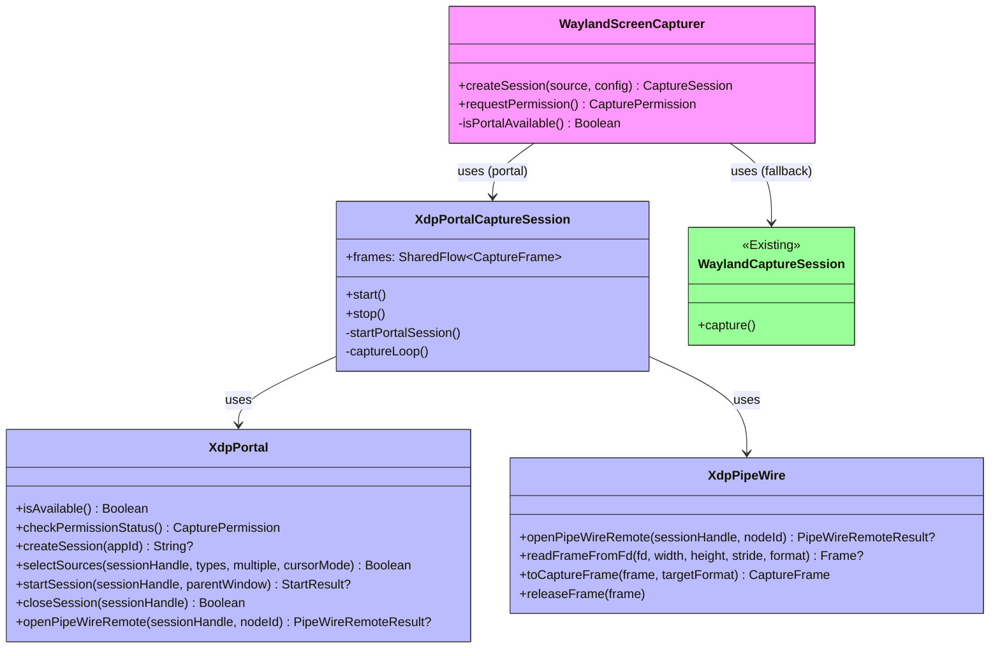
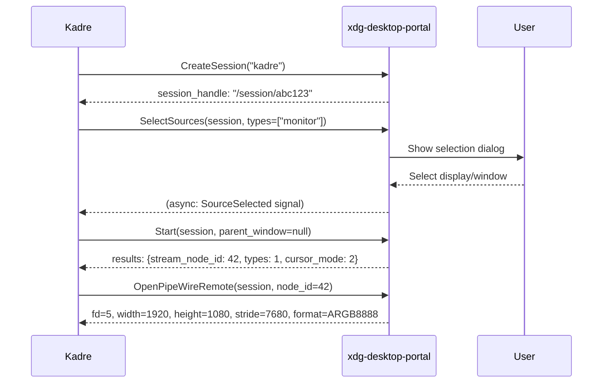
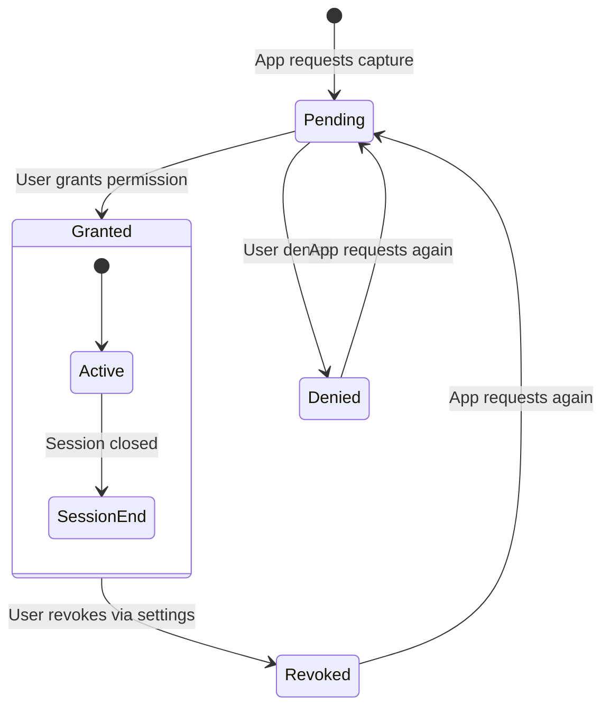
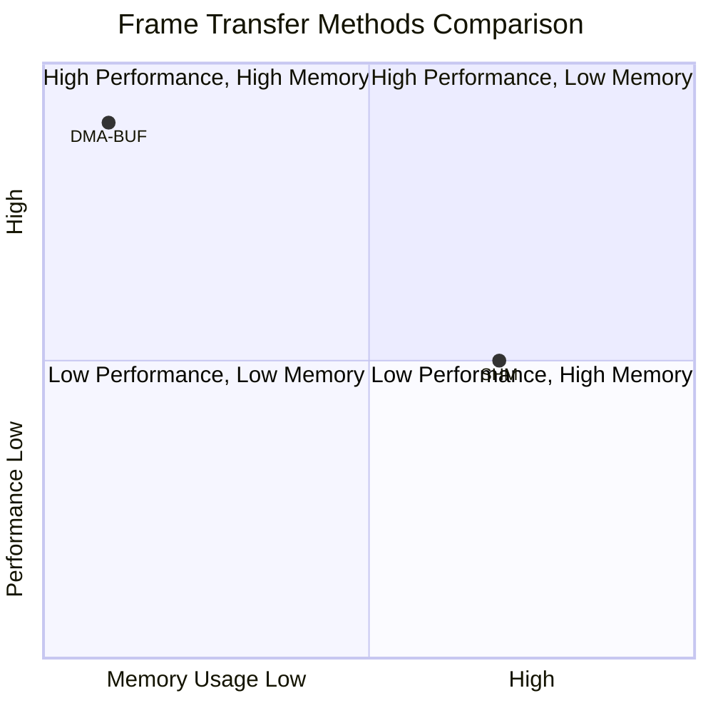
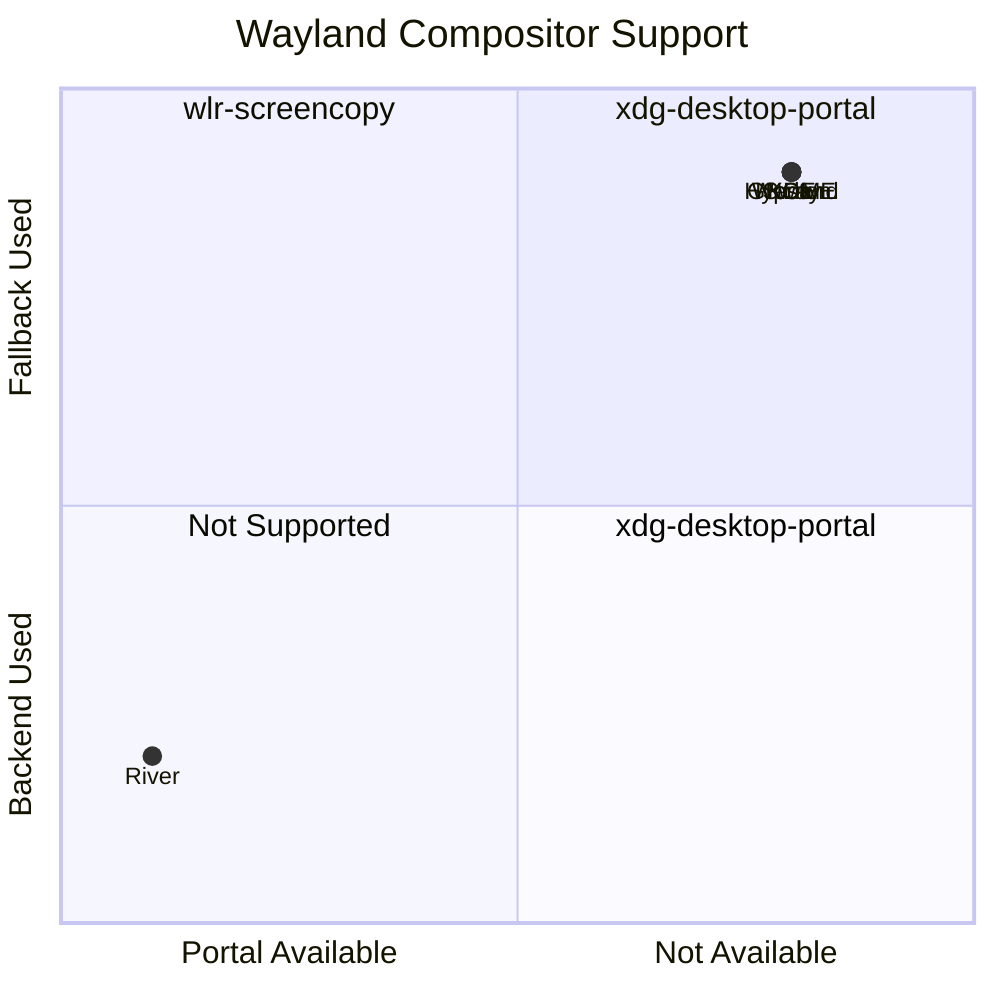

# Wayland Screen Capture via xdg-desktop-portal

## Overview

This document explains the **xdg-desktop-portal** implementation for screen capture on Wayland, which enables capture support on GNOME (Mutter), KDE (KWin), and other desktop environments that don't support the `wlr-screencopy-unstable-v1` protocol.

## Why xdg-desktop-portal?

### The Problem

The existing Wayland capture implementation in Kadre uses **`zwlr_screencopy_manager_v1`** (from the wlroots project). This protocol works well on compositors like:
- ✅ Sway
- ✅ Hyprland  
- ✅ River
- ✅ Cage

However, it **does NOT work** on:
- ❌ GNOME (Mutter compositor)
- ❌ KDE Plasma (KWin compositor)
- ❌ Weston (reference compositor)
- ❌ Most other non-wlroots compositors

This means screen capture was **completely broken** on the most popular Linux desktop environments!

### The Solution

**xdg-desktop-portal** is a Freedesktop standard that provides a unified way for sandboxed applications to access system services, including screen capture. It's supported by:
- ✅ GNOME (via xdg-desktop-portal-gnome)
- ✅ KDE (via xdg-desktop-portal-kde)
- ✅ wlroots-based compositors (Sway, Hyprland, etc.)
- ✅ Weston

By implementing xdg-desktop-portal support, Kadre now works on **all major Wayland compositors**!

## Architecture

```mermaid
flowchart TD
    subgraph Kadre Application Layer
        A[WaylandScreenCapturer.createSession] --> B{Backend Decision}
        B -->|XdpPortal.isAvailable()| C[XdpPortalCaptureSession]
        B -->|Fallback| D[WaylandCaptureSession]
    end
    
    subgraph xdg-desktop-portal Layer
        C --> E[XdpPortal.kt]
        E --> E1[CreateSession → session_handle]
        E --> E2[SelectSources → user prompt]
        E --> E3[Start → stream_node_id]
        E --> E4[OpenPipeWireRemote → fd]
        
        C --> F[XdpPipeWire.kt]
        F --> F1[mmap fd → MemorySegment]
        F1 --> F2[Read pixel data]
        F2 --> F3[Convert to CaptureFrame]
        F3 --> F4[Emit to SharedFlow]
    end
    
    subgraph System Layer
        E1 -->|D-Bus| G[org.freedesktop.portal.ScreenCast]
        G -->|Methods| G1[CreateSession]
        G -->|Methods| G2[SelectSources]
        G -->|Methods| G3[Start]
        G -->|Methods| G4[OpenPipeWireRemote]
        G -->|Methods| G5[Close]
        G -->|Signals| G6[SessionCreated]
        G -->|Signals| G7[SourceSelected]
        G -->|Signals| G8[Started]
        G -->|Signals| G9[Closed]
        
        F4 -->|PipeWire| H[Video Streaming]
        H -->|Supports| H1[DMA-BUF zero-copy GPU]
        H -->|Supports| H2[SHM shared memory]
    end
    
    style A fill:#f9f,stroke:#333
    style C fill:#bbf,stroke:#333
    style D fill:#9f9,stroke:#333
    style G fill:#ff9,stroke:#333
    style H fill:#ff9,stroke:#333
```

### Class Diagram



## Implementation Details

### 1. XdpPortal.kt - D-Bus Communication

This file handles all communication with the xdg-desktop-portal via D-Bus using the `dbus-send` command-line tool.

**Key Functions:**

```kotlin
// Check if portal is available on the system
fun isAvailable(): Boolean

// Check permission status
fun checkPermissionStatus(): CapturePermission

// Create a new screencast session
fun createSession(appId: String = "kadre"): String?

// Select sources (triggers user prompt)
fun selectSources(
    sessionHandle: String,
    types: List<String> = listOf("monitor", "window"),
    multiple: Boolean = false,
    cursorMode: String = "embedded"
): Boolean

// Start the session
fun startSession(
    sessionHandle: String,
    parentWindow: String? = null
): StartResult?

// Close the session
fun closeSession(sessionHandle: String): Boolean
```

**D-Bus Message Flow:**



### 2. XdpPipeWire.kt - Frame Reception

This file handles receiving frames from PipeWire. For the MVP, we use a simplified approach:

**Approach 1: OpenPipeWireRemote (Current Implementation)**
- Call `OpenPipeWireRemote` to get a file descriptor
- `mmap()` the file descriptor to access the frame buffer
- Read pixel data directly from shared memory
- Convert to `CaptureFrame` format

**Approach 2: Full PipeWire Integration (Future)**
- Connect to PipeWire context
- Create a stream for the given node ID
- Set up callbacks for buffer reception
- Handle DMA-BUF for zero-copy GPU frames

**Key Functions:**

```kotlin
// Open PipeWire remote and get file descriptor
fun openPipeWireRemote(sessionHandle: String, nodeId: Int): PipeWireRemoteResult?

// Read frame from mmap'd file descriptor
fun readFrameFromFd(fd: Int, width: Int, height: Int, stride: Int, format: String): Frame?

// Convert to CaptureFrame
fun toCaptureFrame(frame: Frame, targetFormat: PixelFormat): CaptureFrame

// Release frame resources
fun releaseFrame(frame: Frame)
```

### 3. XdpPortalCaptureSession.kt - Session Management

This file orchestrates the complete capture flow:

```kotlin
class XdpPortalCaptureSession(source: CaptureSource, config: CaptureConfig) : CaptureSession {
    init {
        scope.launch {
            startPortalSession()  // 1. Create session
            captureLoop()          // 2. Capture frames in loop
        }
    }
    
    private suspend fun startPortalSession() {
        sessionHandle = XdpPortal.createSession("kadre")
        XdpPortal.selectSources(sessionHandle, types = listOf("monitor"))
        val result = XdpPortal.startSession(sessionHandle)
        streamNodeId = result.streamNodeId
        pipeWireRemote = XdpPipeWire.openPipeWireRemote(sessionHandle, streamNodeId)
    }
    
    private suspend fun captureLoop() {
        while (isCapturing) {
            val pwFrame = readNextFrame()
            val captureFrame = XdpPipeWire.toCaptureFrame(pwFrame, config.pixelFormat)
            _frames.tryEmit(captureFrame)
            delay(1000 / config.frameRate)
        }
    }
}
```

### 4. WaylandScreenCapturer.kt - Backend Selection

Updated to try portal first, then fall back to wlr-screencopy:

```kotlin
override suspend fun createSession(source: CaptureSource, config: CaptureConfig): CaptureSession {
    return if (XdpPortal.isAvailable()) {
        XdpPortalCaptureSession(source, config)
    } else {
        WaylandCaptureSession(source, config)  // Existing wlr-screencopy
    }
}

override suspend fun requestPermission(): CapturePermission =
    if (XdpPortal.isAvailable()) XdpPortal.checkPermissionStatus() else CapturePermission.Pending
```

## System Requirements

### Required Packages

```bash
# Ubuntu/Debian
sudo apt install xdg-desktop-portal xdg-desktop-portal-gnome pipewire

# Fedora
sudo dnf install xdg-desktop-portal xdg-desktop-portal-gnome pipewire

# Arch Linux
sudo pacman -S xdg-desktop-portal xdg-desktop-portal-gnome pipewire

# openSUSE
sudo zypper install xdg-desktop-portal xdg-desktop-portal-gnome pipewire
```

### Verifying Installation

```bash
# Check if portal is running
ps aux | grep xdg-desktop-portal

# Check ScreenCast interface availability
dbus-send --print-reply --dest=org.freedesktop.portal.Desktop \
  /org/freedesktop/portal/desktop \
  org.freedesktop.DBus.Properties.Get \
  string:"org.freedesktop.portal.ScreenCast" string:"version"

# Check PipeWire
pw-cli list-objects | grep "screen cast"
```

## User Experience Flow

```mermaid
flowchart TD
    subgraph GNOME/KDE with portal
        A1[Create Session] --> B1[Portal shows dialog]
        B1 -->|User selects| C1[Entire screen / Window / Region]
        C1 --> D1[Start Session]
        D1 --> E1[Receive PipeWire frames]
        E1 --> F1[Convert to CaptureFrame]
        F1 --> G1[Emit via SharedFlow]
    end
    
    subgraph Sway/Hyprland fallback
        A2[XdpPortal.isAvailable() = false] --> B2[Use wlr-screencopy]
        B2 --> C2[Direct Wayland capture]
        C2 --> D2[No user prompt]
        D2 --> E2[Receive frames]
    end
    
    style A1 fill:#bbf,stroke:#333
    style B1 fill:#bbf,stroke:#333
    style C1 fill:#bbf,stroke:#333
    style A2 fill:#9f9,stroke:#333
    style B2 fill:#9f9,stroke:#333
```

### On GNOME/KDE (with portal)

1. **Create Session**: Kadre requests a new screencast session
2. **Select Sources**: Portal shows a dialog asking user to select display/window
   - User sees: "Kadre wants to capture your screen. Select what to share."
   - Options: Entire screen, Specific window, Specific region
3. **Start Session**: Portal starts streaming frames
4. **Receive Frames**: Kadre receives frames via PipeWire
5. **Capture**: Frames are converted to `CaptureFrame` and emitted via `SharedFlow`

### On Sway/Hyprland (without portal)

1. **Fallback**: `XdpPortal.isAvailable()` returns false
2. **Use wlr-screencopy**: Falls back to existing implementation
3. **Direct Capture**: Frames captured directly via Wayland protocol
4. **No User Prompt**: No permission dialog (compositor allows it)

## Permission Model

### xdg-desktop-portal Permissions

The portal uses a **user-mediated permission model**:



1. **First Request**: When an app requests screen capture, the portal shows a dialog
2. **User Selection**: User must explicitly select what to share
3. **Persistent Permission**: Once granted, permission persists for the session
4. **Revocation**: User can revoke via system settings

### Permission States

```kotlin
sealed interface CapturePermission {
    object Granted : CapturePermission      // Permission granted, capture works
    object Pending : CapturePermission      // Waiting for user to grant permission
    data class Denied(val reason: String) : CapturePermission  // User denied
}
```

### Checking Permission Status

```kotlin
val capturer = ScreenCapturer.resolve()
val status = capturer.permissionStatus()

when (status) {
    CapturePermission.Granted -> startCapture()
    CapturePermission.Pending -> showMessage("Please grant screen capture permission")
    is CapturePermission.Denied -> showError(status.reason)
}
```

## Error Handling

### CaptureError Types

```kotlin
sealed class CaptureError(message: String, cause: Throwable? = null) : Exception(message, cause) {
    class PermissionDenied(reason: String) : CaptureError(reason)
    class NoSuchSource(source: CaptureSource) : CaptureError("No such source: $source")
    class SourceLost(source: CaptureSource) : CaptureError("Source lost: $source")
    class Unsupported(reason: String) : CaptureError(reason)
    class Internal(cause: Throwable) : CaptureError("Internal error", cause)
}
```

### Common Error Scenarios

| Scenario | Error | Solution |
|----------|-------|----------|
| Portal not installed | `Internal` | Install xdg-desktop-portal |
| User denied permission | `PermissionDenied` | Request permission again |
| No displays available | `NoSuchSource` | Check display connection |
| PipeWire not available | `Internal` | Install PipeWire |
| Session timeout | `Internal` | Retry session creation |

## Performance Considerations

### Frame Transfer Methods



| Method | Performance | Memory Usage | GPU Support | Notes |
|--------|-------------|---------------|--------------|-------|
| SHM (Shared Memory) | Medium | High (CPU copy) | ❌ No | Works everywhere, simple |
| DMA-BUF | High | Low (zero-copy) | ✅ Yes | Requires GPU support |

### Current Implementation

- **MVP**: Uses SHM via `OpenPipeWireRemote` + `mmap()`
- **Future**: Add DMA-BUF support for zero-copy GPU frames

### Frame Rate Control

```kotlin
CaptureConfig(
    frameRate: 30,  // Target frame rate
    pixelFormat: PixelFormat.RGBA8,
    captureCursor: true,
    region: null
)
```

The capture loop respects the frame rate:
```kotlin
delay(1000L / config.frameRate)
```

## Testing

### Manual Testing

```bash
# List displays
./gradlew :samples:screen-capture-demo:run --args="--list-displays"

# Capture from display
./gradlew :samples:screen-capture-demo:run --args="--capture-display 0 --output /tmp/captures"

# Capture from window (if supported)
./gradlew :samples:screen-capture-demo:run --args="--capture-window <id> --output /tmp/captures"
```

### Testing on Different Compositors



| Composer | Portal Available | wlr-screencopy | Expected Backend |
|----------|------------------|----------------|------------------|
| GNOME (Mutter) | ✅ Yes | ❌ No | xdg-desktop-portal |
| KDE (KWin) | ✅ Yes | ❌ No | xdg-desktop-portal |
| Sway | ✅ Yes | ✅ Yes | xdg-desktop-portal (preferred) |
| Hyprland | ✅ Yes | ✅ Yes | xdg-desktop-portal (preferred) |
| Weston | ✅ Yes | ❌ No | xdg-desktop-portal |
| River | ❌ No | ✅ Yes | wlr-screencopy (fallback) |

### Debugging

Enable debug output:
```bash
# Set environment variable for verbose logging
export KADRE_CAPTURE_DEBUG=true
./gradlew :samples:screen-capture-demo:run --args="--capture-display 0"
```

Check D-Bus communication:
```bash
# Monitor D-Bus messages
dbus-monitor --profile "interface='org.freedesktop.portal.ScreenCast'"
```

## Future Enhancements

### 1. Full PipeWire Integration
- Use libpipewire FFM bindings instead of `dbus-send` + `mmap`
- Support DMA-BUF for zero-copy GPU frames
- Handle multiple streams (for multi-monitor setups)

### 2. Session Management
- Track multiple active sessions
- Handle session closure signals
- Implement proper cleanup on errors

### 3. Cursor Capture
- Support `cursor_mode` parameter:
  - `none`: No cursor
  - `hidden`: Cursor is hidden
  - `embedded`: Cursor embedded in frames
  - `metadata`: Cursor position/data separate

### 4. Region Capture
- Support `region` parameter in `CaptureConfig`
- Allow capturing specific screen regions
- Use `SelectRegion` portal method

### 5. Window Capture
- Properly implement window selection
- Handle window resizing/moving
- Track window lifecycle

### 6. Permission Persistence
- Store granted permissions
- Avoid re-prompting user on app restart
- Handle permission revocation

## References

- [xdg-desktop-portal Documentation](https://flatpak.github.io/xdg-desktop-portal/docs/doc-org.freedesktop.portal.ScreenCast.html)
- [PipeWire Documentation](https://pipewire.pages.freedesktop.org/)
- [Wayland Protocol Documentation](https://wayland.freedesktop.org/docs/html/)
- [Freedesktop D-Bus Specification](https://dbus.freedesktop.org/doc/dbus-specification.html)

## Appendix: D-Bus Interface Definition

```xml
<interface name="org.freedesktop.portal.ScreenCast">
  <method name="CreateSession">
    <arg type="s" name="app_id" direction="in"/>
    <arg type="o" name="session_handle" direction="out"/>
  </method>
  
  <method name="SelectSources">
    <arg type="o" name="session_handle" direction="in"/>
    <arg type="as" name="types" direction="in"/>
    <arg type="a{sv}" name="options" direction="in"/>
  </method>
  
  <method name="Start">
    <arg type="o" name="session_handle" direction="in"/>
    <arg type="s" name="parent_window" direction="in"/>
    <arg type="a{sv}" name="options" direction="in"/>
    <arg type="a{sv}" name="results" direction="out"/>
  </method>
  
  <method name="OpenPipeWireRemote">
    <arg type="o" name="session_handle" direction="in"/>
    <arg type="h" name="node_id" direction="in"/>
    <arg type="h" name="fd" direction="out"/>
    <arg type="a{sv}" name="metadata" direction="out"/>
  </method>
  
  <method name="Close">
    <arg type="o" name="session_handle" direction="in"/>
  </method>
  
  <signal name="SessionCreated">
    <arg type="o" name="session_handle"/>
  </signal>
  
  <signal name="SourceSelected">
    <arg type="o" name="session_handle"/>
    <arg type="s" name="source_type"/>
    <arg type="s" name="source_handle"/>
  </signal>
  
  <signal name="Started">
    <arg type="o" name="session_handle"/>
    <arg type="u" name="stream_node_id"/>
  </signal>
  
  <signal name="Closed">
    <arg type="o" name="session_handle"/>
    <arg type="u" name="reason"/>
  </signal>
</interface>
```
